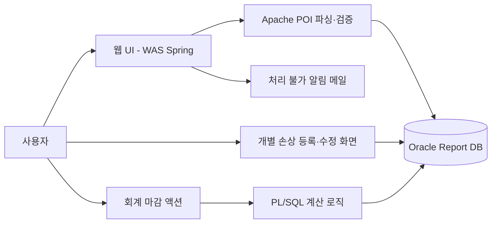
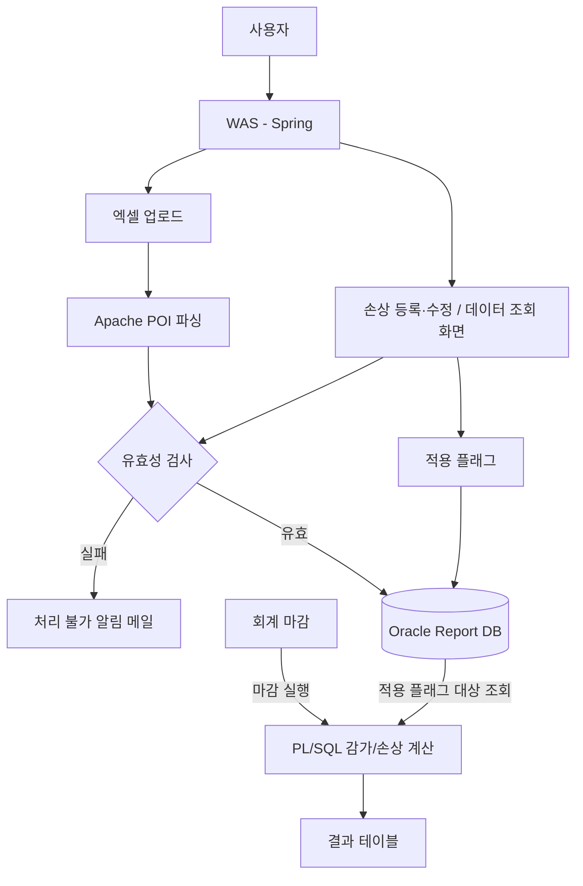
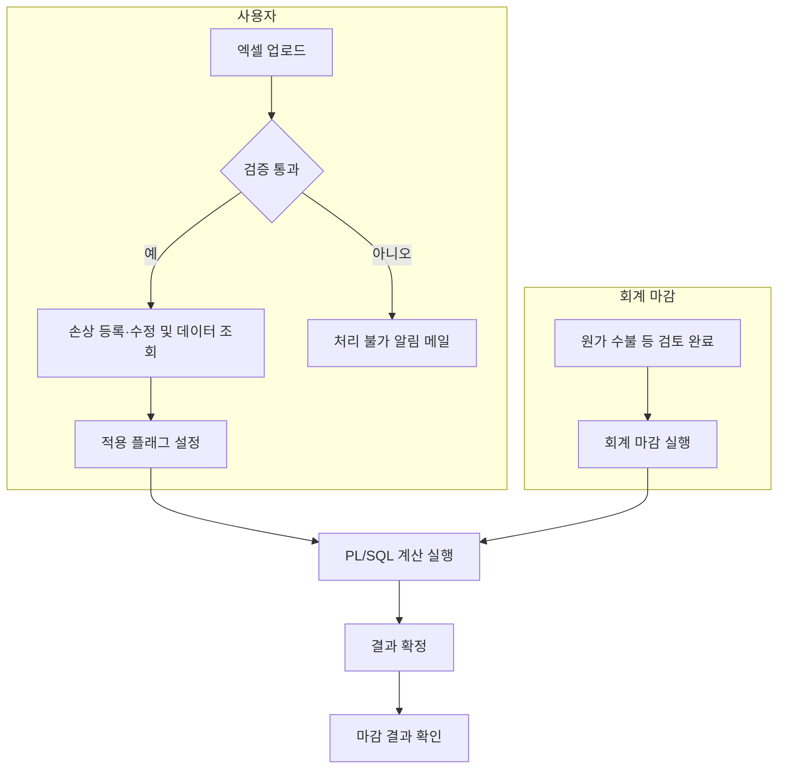
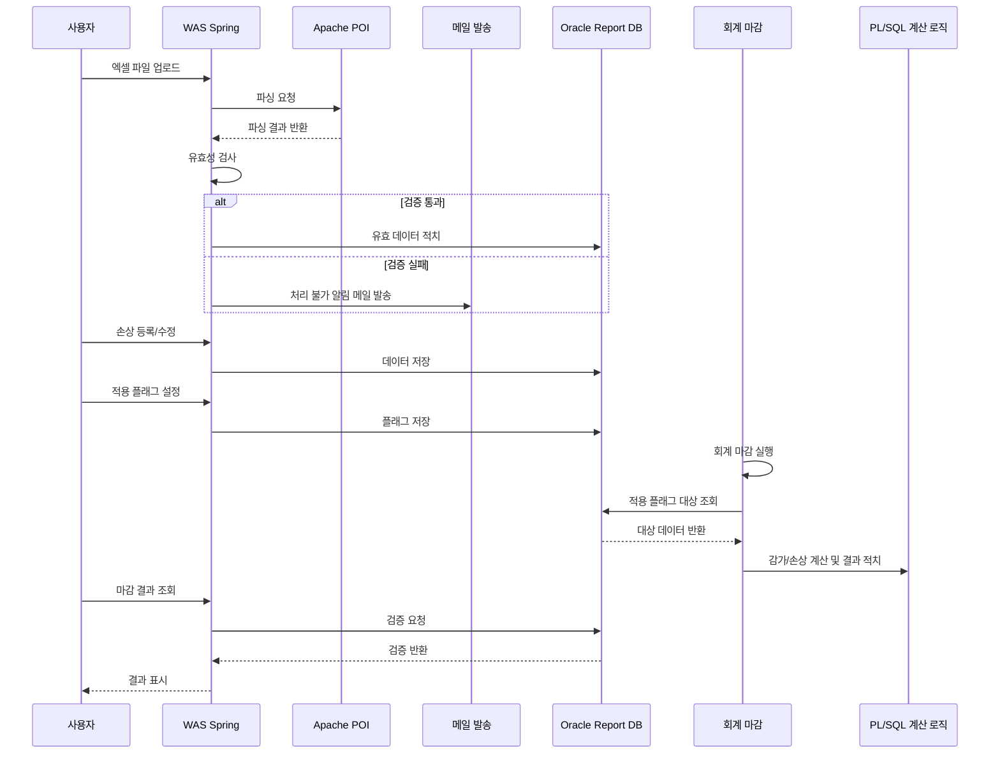

# 손상차손 시스템

손상차손 데이터를 표준화·자동화해 수작업 검증·보고 시간을 대폭 단축하고, 운영 효율과 데이터 신뢰성을 높인 프로젝트.

## 배경

기존에는 이미 감가상각 시스템이 구축되어 있어 월별 상각 처리는 자동화되어 있었지만, 회계 기준상 손상차손을 반영해야 하는 자산에 대해서는 지원이 없어 실무자가 결산 시마다 Excel로 직접 계산하고 보고서를 작성해야 했다. 이 때문에 업무가 반복적이고 복잡했으며, 자동화된 처리가 필요했다.

## 해결하려던 문제

- 손상 발생 이후에는 기존 상각 로직이 적용되지 않아 매번 수작업으로 재계산해야 함
- 수작업 계산 과정에서 휴먼 에러와 결산 지연이 빈번
- 데이터가 표준화·중앙화되지 않아 감사 대응 및 이력 추적이 어려움
- 결산 마감 기간의 업무 부담을 줄이고 신뢰성 있는 자동화 체계 구축이 필요

## 목표

- 회계감사 대응: 손상차손이 반영된 감가상각 데이터를 회계 기준에 맞게 정확히 산출해, 결산 및 회계감사 과정에서 문제없이 제출할 수 있도록 지원
- 신뢰성 높은 자동화: 실무자가 복잡한 계산을 반복하지 않고 표준화된 Excel 업로드와 간단한 조작만으로 손상 반영 데이터를 생성·검증할 수 있도록 구현
- 업무 효율성 향상: 수작업 계산·검증 과정에서 발생할 수 있는 휴먼 에러를 최소화하고, 보고 및 결산 업무 속도를 높이는 안정적 시스템 구축

## 아키텍처

기존 사내 표준 아키텍처(WAS + DB)를 기반으로, 입력·검증·적용은 WAS에서, 대량 계산은 DB에서 처리하도록 역할을 나눴다.

Excel 업로드와 화면 입력 두 경로 모두 유효성 검사를 거쳐 ReportDB에 적치되고, 회계 마감 시점에 PL/SQL이 적용 플래그가 켜진 대상만 골라 계산한다.

**이 구조를 선택한 이유**

- 기존 감가상각 로직과의 일관성 및 대용량 계산 성능 때문에 계산 로직은 PL/SQL로 유지했다.
- xPlatform은 업로드 기능이 없다는 한계가 있어, Spring 기반 WAS로 업로드/검증 화면을 신규 개발했다.
- 검증·적용·마감 로직을 분리해 결산 신뢰성과 업무 효율성을 함께 높였다.

**기술 스택 매핑**

- Backend: Java, Spring Framework, Apache POI(업로드/파싱/유효성 검사), JavaMailSender/SMTP(업로드 오류 및 처리 결과 알림)
- Frontend: Kendo UI(Grid), 일부 xPlatform 화면 병행
- Database: Oracle Report DB, PL/SQL(손상차손 계산 로직)
- 운영/아키텍처: 기존 사내 표준 아키텍처 기반(WAS + DB), 입력·검증·적용은 WAS에서, 대량 계산은 DB에서 처리

## 비즈니스 플로우

사용자 경로(엑셀 업로드 → 검증 → 적용 플래그)와 회계 마감 경로가 별도로 진행되다가, 마감 시점에 PL/SQL 계산에서 합류한다.

시간 순서로 보면 업로드/등록 단계와 마감 실행 단계가 분리돼 있다가, 마감 시점에 대상 데이터를 조회해 계산·적치한다.

## 담당한 일

- 요구사항 분석·설계: 회계팀과 손상차손 계산 및 마감 프로세스 요구사항 정리, 기존 감가상각 로직 파악 및 연계성 검토, 손상 적용·검증·마감 흐름을 고려한 테이블 구조 설계
- DB 로직 구현: 손상차손 관련 적치 테이블 설계, Oracle PL/SQL 계산 로직 구현 보조, 테스트 데이터로 계산 결과 검증
- 백엔드·프런트엔드 개발: Spring 기반 REST API 개발, Apache POI로 Excel 업로드 및 유효성 검사 구현, Kendo Grid 및 일부 xPlatform 화면 연동으로 조회·수정 UI 구현
- 테스트 및 검증 협업: 단위 테스트와 기본 통합 테스트 수행 후 실무 확인 요청 및 피드백 반영, 오류·예외 로깅과 실패 시 알림 메일 발송 흐름 점검
- 운영 지원: 초기 운영 단계의 데이터 불일치·처리 실패 이슈 원인 파악 및 수정

## 기술 선택 이유

- **Apache POI**: 안정적인 Excel 파싱과 데이터 유효성 검사를 위해 채택했다.
- **Kendo UI/Grid**: 사용자 친화적인 UI와 사내 표준 컴포넌트라 채택했다.
- **JavaMailSender/SMTP**: 표준 메일 발송 프로세스를 그대로 활용했다.
- **Oracle PL/SQL**: 대용량 데이터 계산 성능과 기존 DB 환경을 그대로 활용하기 위해 채택했다.

## 트러블슈팅

초기 테스트 단계에서 회계 마감 실행 시 손상 적용 후 계산 결과가 맞지 않는 사례가 여러 차례 발생했다. PL/SQL 계산 로직 대부분은 팀장님이 주도적으로 수정했고, 계산식과 데이터 흐름을 함께 점검하며 재테스트를 반복해 최종적으로 정상화했다.

- **테스트 데이터 확보 지연**: 회계팀에서 제공하는 검증용 데이터 확보에 평균 1주일가량 소요되어 개발 일정이 지연될 우려가 있었다. 초기에는 자체적으로 샘플 데이터를 생성해 단위 테스트를 진행하고, 이후 회계팀이 제공한 실제 데이터로 검증 단계를 보완해 일정 차질을 최소화했다.
- **기존 마감 로직과 연계 문제**: 손상차손 기능이 기존 회계 마감 프로세스의 트리거 흐름에 통합되어야 했기 때문에, 마감 실행 시점과 플래그 처리 방식을 파악하는 데 시간이 걸렸다. 회계 마감 프로세스를 분석해 손상차손 적용 플래그가 정상적으로 반영되도록 로직과 연계 포인트를 점검·조정했다.

## 기술

- Java, Spring Framework
- Oracle, PL/SQL
- Apache POI
- Kendo UI (Grid), xPlatform

## 결과

회계 마감 시점에 적용 플래그 대상만 집계·계산하도록 분리해, 마감 실행 시 치명적 중단 없이 처리했고 테스트 단계에서 발견된 이슈들은 사전에 수정을 완료했다. Excel 업로드 자동 검증과 개별 자산 손상 등록·수정(+/− 보정) 기능으로 잘못 입력된 값도 화면에서 보정할 수 있게 되어 휴먼 에러가 최소화됐다. 업로드 원본 → 검증 통과 데이터 → 적용 플래그 → 마감 결과 테이블의 흐름이 DB에 남아 계산 근거와 결과를 확인·대조하기 쉬워졌다. "사용자 입력·검증·적용"과 "회계 마감 실행"을 분리해 권한과 책임을 명확히 했다.
