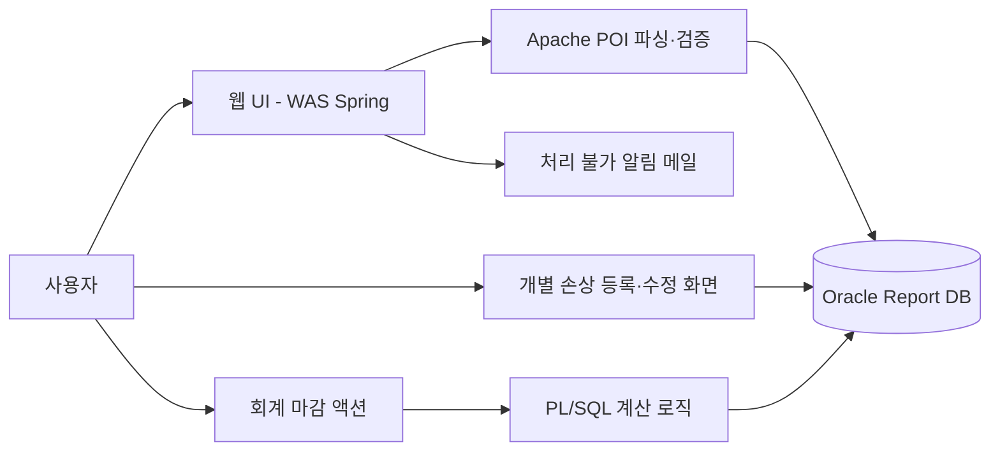
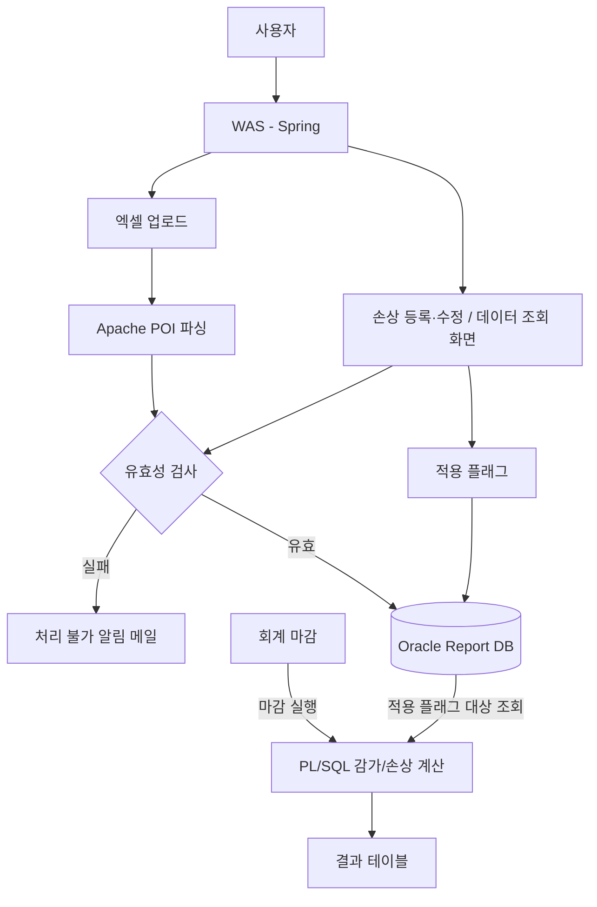
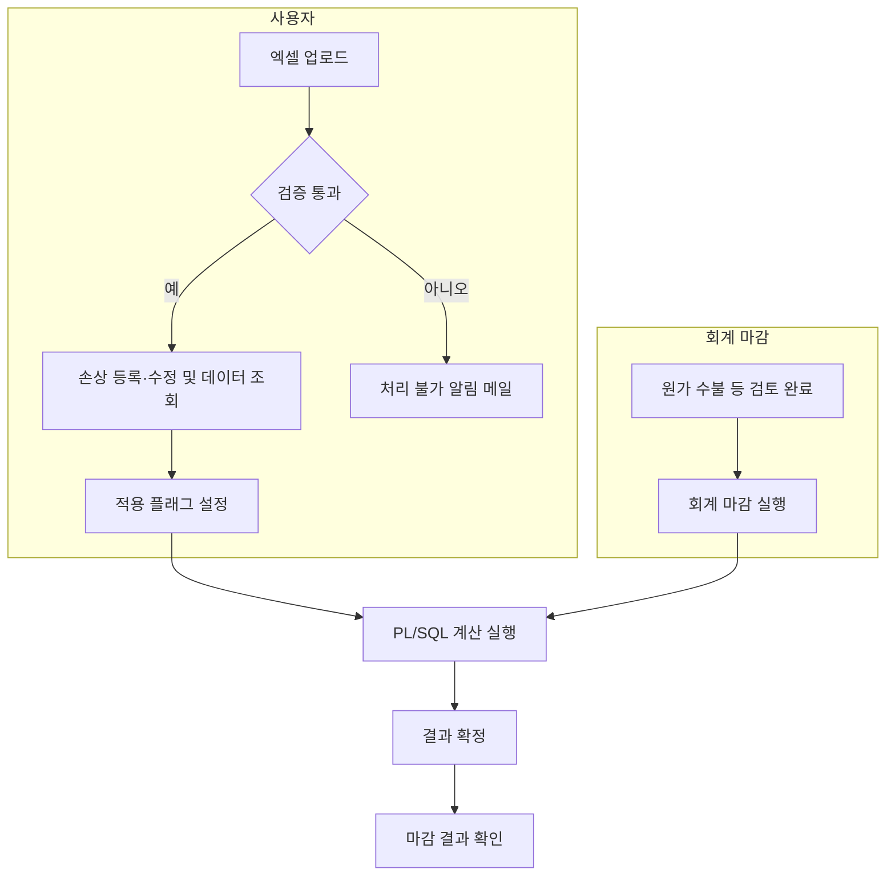
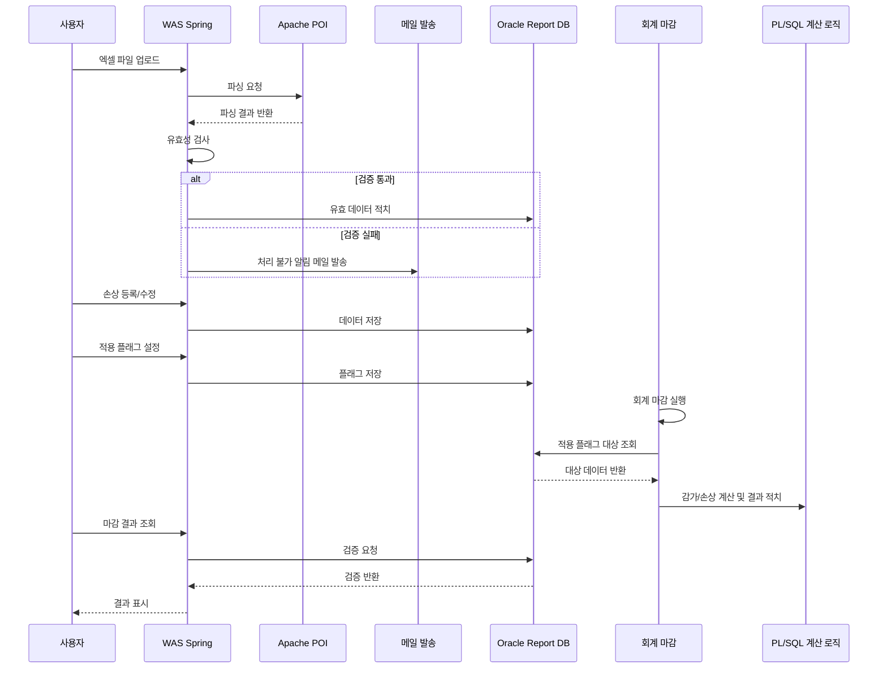

# 손상차손 시스템

회사 보유 설비의 손상차손을 Excel 업로드로 받아 검증하고, 월 결산 마감 시 감가를 자동으로 다시 계산하도록 만든 프로젝트.

## 배경

회사가 보유한 설비 전체는 감가상각 대상이고, 월 결산 때 자산별 감가가 자동으로 처리되는 감가상각 시스템이 이미 있었다. 기존 시스템의 조회 화면은 xPlatform으로 제공되고 있었고, 거기서는 감가 데이터를 보여주는 역할만 했다.

문제는 손상차손이었다. 특정한 사유로 자산의 가치가 장부에 잡힌 금액보다 줄어들면 그만큼을 손상으로 인식하고, 이후 남은 기간의 감가를 다시 계산해야 한다. 이 처리를 지원하는 기능이 없어서, 회계팀이 결산 때마다 Excel로 직접 계산하고 보고서를 만들었다. 대상이 설비 전체이고 금액 규모도 큰 데다 매월 반복되는 작업이라 부담이 컸고, 계산 실수가 곧 결산 오류로 이어질 수 있었다.

### 손상차손이 감가에 미치는 영향 (단순화한 예시)

| 구분 | 금액 | 설명 |
|---|---|---|
| 기존 감가 | 월 10씩 | 지금까지 60까지 감가를 반영한 상태 |
| 남은 장부가 | 40 | 앞으로 4회 더 감가해야 하는 금액 |
| 손상차손 | 15 | 자산 가치가 줄어 추가로 인식해야 하는 금액 |
| 손상 반영 후 장부가 | 25 | 40 − 15 |
| 변경된 월 감가 | 약 6 | 25를 남은 4회에 나눔 (기존 10 → 약 6) |

즉 손상이 매겨지는 순간부터 해당 자산의 월 감가액이 달라지기 때문에, 기존 상각 로직을 그대로 쓸 수 없고 손상 이후 구간을 따로 계산해야 한다. (개념을 설명하기 위해 단순화한 예시이며, 실제 계산은 회계 기준과 자산별 조건에 따라 더 복잡하다.)

## 해결하려던 문제

- 손상이 발생한 자산은 월 감가액이 바뀌는데, 기존 상각 로직은 이를 반영하지 못해 결산 때마다 수작업으로 재계산해야 함
- 설비 전체가 대상이라 건수가 많고, 수작업 계산 과정에서 휴먼 에러와 결산 지연이 발생
- 데이터가 표준화·중앙화되어 있지 않아 감사 대응과 이력 추적이 어려움
- 회계팀이 이미 Excel로 작성하는 양식은 유지하면서, 입력 오류를 시스템에서 걸러낼 필요가 있음

## 목표

- 회계감사 대응: 손상차손이 반영된 감가상각 데이터를 회계 기준에 맞게 정확히 산출해, 결산 및 회계감사 과정에서 문제없이 제출할 수 있도록 지원
- 신뢰성 높은 자동화: 실무자가 복잡한 계산을 반복하지 않고 표준화된 Excel 업로드와 간단한 조작만으로 손상 반영 데이터를 생성·검증할 수 있도록 구현
- 업무 효율성 향상: 수작업 계산·검증 과정에서 발생할 수 있는 휴먼 에러를 최소화하고, 보고 및 결산 업무 속도를 높이는 안정적 시스템 구축

## 아키텍처

기존 사내 표준 아키텍처(WAS + DB)를 기반으로, 입력·검증·적용은 신규 개발한 Spring WAS에서, 대량 계산은 DB의 PL/SQL에서 처리하도록 역할을 나눴다. 기존 xPlatform 화면은 감가 데이터 조회용으로 그대로 두고, 손상 입력과 검증은 새 웹 화면에서 처리한다.

```mermaid
flowchart LR
    U[사용자] --> W[웹 UI - WAS Spring]
    W --> P[Apache POI 파싱·검증]
    P --> R[(Oracle Report DB)]
    W --> M[처리 불가 알림 메일]
    U --> C[개별 손상 등록·수정 화면]
    C --> R
    U --> A[회계 마감 액션]
    A --> L[PL/SQL 계산 로직]
    L --> R
```

Excel 업로드와 화면 입력 두 경로 모두 유효성 검사를 거쳐 ReportDB에 적치되고, 회계 마감 시점에 PL/SQL이 적용 플래그가 켜진 대상만 골라 계산한다.

```mermaid
flowchart TD
    U[사용자] --> W[WAS - Spring]
    W --> X[엑셀 업로드]
    W --> C[손상 등록·수정 / 데이터 조회 화면]
    X --> P[Apache POI 파싱]
    P --> V{유효성 검사}
    C --> V
    C --> F[적용 플래그]
    V -- 실패 --> M[처리 불가 알림 메일]
    V -- 유효 --> R[(Oracle Report DB)]
    F --> R
    AC[회계 마감] -->|마감 실행| PL[PL/SQL 감가/손상 계산]
    R -->|적용 플래그 대상 조회| PL
    PL --> RT[결과 테이블]
```

**이 구조를 선택한 이유**

- 기존 감가상각 로직과의 일관성 및 대용량 계산 성능 때문에 계산 로직은 DB의 PL/SQL에 두었다.
- xPlatform은 감가 데이터를 보여주는 화면이고 Excel 업로드·검증 기능이 없어, 회계팀의 Excel을 받아 처리하는 부분은 Spring 기반 WAS로 신규 개발했다.
- 검증·적용·마감 로직을 분리해 결산 신뢰성과 업무 효율성을 함께 높였다.

**기술 스택 매핑**

- Backend: Java, Spring Framework, Apache POI(업로드/파싱/유효성 검사), JavaMailSender/SMTP(업로드 오류 및 처리 결과 알림)
- Frontend: Kendo UI(Grid). 기존 감가 조회 화면은 xPlatform 유지
- Database: Oracle Report DB, PL/SQL(손상차손 계산 로직)
- 운영/아키텍처: 기존 사내 표준 아키텍처 기반(WAS + DB), 입력·검증·적용은 WAS에서, 대량 계산은 DB에서 처리

## 비즈니스 플로우

사용자 경로(엑셀 업로드 → 검증 → 적용 플래그)와 회계 마감 경로가 별도로 진행되다가, 마감 시점에 PL/SQL 계산에서 합류한다.

```mermaid
flowchart TD
    subgraph 사용자
        E[엑셀 업로드] --> V{검증 통과}
        V -- 예 --> R[손상 등록·수정 및 데이터 조회]
        R --> F[적용 플래그 설정]
        V -- 아니오 --> M[처리 불가 알림 메일]
    end
    subgraph 회계마감["회계 마감"]
        A[원가 수불 등 검토 완료] --> B[회계 마감 실행]
    end
    F --> P[PL/SQL 계산 실행]
    B --> P
    P --> C[결과 확정]
    C --> D[마감 결과 확인]
```

시간 순서로 보면 업로드/등록 단계와 마감 실행 단계가 분리돼 있다가, 마감 시점에 대상 데이터를 조회해 계산·적치한다.

```mermaid
sequenceDiagram
    participant U as 사용자
    participant W as WAS Spring
    participant P as Apache POI
    participant Ml as 메일 발송
    participant R as Oracle Report DB
    participant C as 회계 마감
    participant L as PL/SQL 계산 로직

    U->>W: 엑셀 파일 업로드
    W->>P: 파싱 요청
    P-->>W: 파싱 결과 반환
    W->>W: 유효성 검사
    alt 검증 통과
        W->>R: 유효 데이터 적치
    else 검증 실패
        W->>Ml: 처리 불가 알림 메일 발송
    end

    U->>W: 손상 등록/수정
    W->>R: 데이터 저장
    U->>W: 적용 플래그 설정
    W->>R: 플래그 저장

    C->>C: 회계 마감 실행
    C->>R: 적용 플래그 대상 조회
    R-->>C: 대상 데이터 반환
    C->>L: 감가/손상 계산 및 결과 적치

    U->>W: 마감 결과 조회
    W->>R: 검증 요청
    R-->>W: 검증 반환
    W-->>U: 결과 표시
```

## 담당한 일

- 요구사항 분석·설계: 회계팀과 손상차손 반영 및 마감 프로세스 요구사항을 정리하고, 기존 감가상각 로직과의 연계성을 검토. 손상 적용·검증·마감 흐름을 고려한 적치 테이블 구조 설계
- Excel 업로드와 파싱: 회계팀이 작성하는 Excel을 Apache POI로 파싱하고, 항목별 유효성 검사를 구현. 검증 실패 시 사유를 담은 처리 불가 알림 메일 발송
- 손상 등록·수정 화면: 개별 자산의 손상을 화면에서 직접 등록하고 +/− 보정할 수 있는 Kendo Grid 화면과 REST API 개발
- 마감 연계: 적용 플래그가 켜진 대상만 회계 마감 시 DB 계산 로직이 읽어 가도록 기존 마감 흐름과의 연계 지점을 분석하고 조정
- 테스트: 테스트 데이터로 계산 결과를 검증하고, 실무 테스트에서 나온 피드백과 오류를 반영

## 기술 선택 이유

- **Apache POI**: 안정적인 Excel 파싱과 데이터 유효성 검사를 위해 채택했다.
- **Kendo UI/Grid**: 사용자 친화적인 UI와 사내 표준 컴포넌트라 채택했다.
- **JavaMailSender/SMTP**: 표준 메일 발송 프로세스를 그대로 활용했다.
- **Oracle PL/SQL**: 대용량 데이터 계산 성능과 기존 DB 환경을 그대로 활용하기 위해 채택했다.

## 트러블슈팅

개발과 테스트 단계에서 일반적인 문제를 두루 겪었다. 대표적인 것은 다음과 같다.

- **Excel 파싱 오류**: 회계팀이 작성한 Excel을 읽는 과정에서 파싱이 의도대로 되지 않는 경우가 있었다. 파싱 후 유효성 검사를 먼저 거치도록 해, 문제가 있는 데이터는 DB에 적치되기 전에 걸러내고 알림 메일로 알렸다.
- **계산 결과 불일치**: 손상 적용 후 마감을 실행했을 때 계산 결과가 기대와 맞지 않는 사례가 여러 차례 있었다. 계산식과 데이터 흐름을 함께 점검하고 테스트를 반복해 정상화했다.
- **테스트 데이터 확보 지연**: 회계팀이 제공하는 검증용 데이터를 받는 데 평균 1주일가량 걸렸다. 그동안은 직접 만든 샘플 데이터로 단위 테스트를 진행하고, 실제 데이터가 오면 검증을 보완해 일정 차질을 줄였다.
- **기존 마감 로직과의 연계**: 손상차손이 기존 회계 마감 프로세스의 트리거 흐름에 들어가야 해서, 마감 실행 시점과 플래그 처리 방식을 파악하는 데 시간이 걸렸다. 마감 프로세스를 분석해 적용 플래그가 정상 반영되도록 연계 지점을 조정했다.

## 기술

- Java, Spring Framework
- Oracle, PL/SQL
- Apache POI
- Kendo UI (Grid), xPlatform

## 결과

개발을 마치고 실무 테스트를 마무리한 시점에 인수인계 후 퇴사해, 실제 운영 단계의 성과 지표는 확인하지 못했다. 구조적으로는 다음을 갖췄다.

- Excel 업로드 시 자동 검증으로 잘못된 입력을 DB에 들어가기 전에 걸러내고, 개별 자산의 손상 등록·수정(+/− 보정)을 화면에서 처리할 수 있게 했다.
- 업로드 원본 → 검증 통과 데이터 → 적용 플래그 → 마감 결과 테이블의 흐름이 DB에 남아, 계산 근거와 결과를 확인·대조하기 쉬운 구조가 됐다.
- "사용자 입력·검증·적용"과 "회계 마감 실행"을 분리해 권한과 책임을 명확히 했다.
