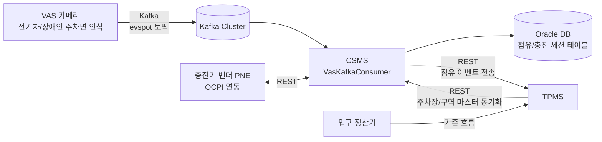
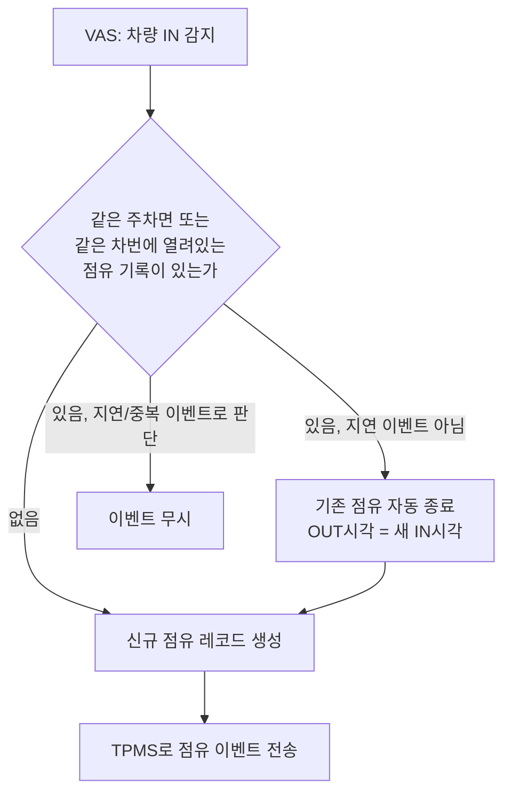
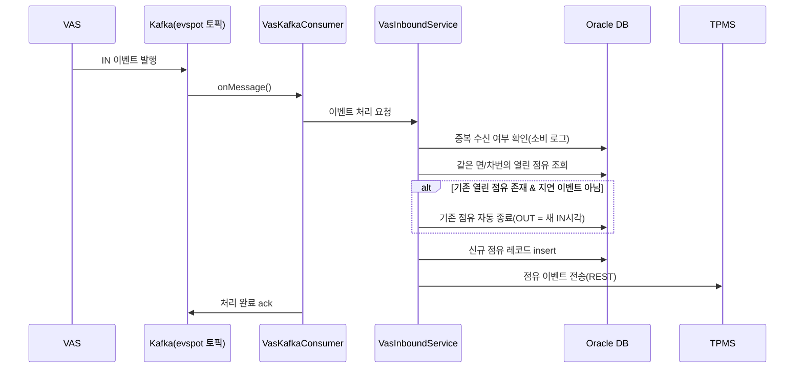

# 부천 CSMS 전기차 충전 관리 시스템

퇴사자가 진행하던 전기차 충전 관리 시스템(CSMS) 구축 프로젝트를 인수인계 받아 홀로 맡아, 잔여 개발과 연계 기능 확장, 감리 대응까지 마무리한 프로젝트.

## 배경

부천 사이트에는 이미 TPMS(Total Parking Management System, 통합주차관리 시스템)가 운영되고 있다. 차량이 입차하면 입구 정산기가 차량 번호를 인식해 TPMS로 전달하고(사전에 행안부 저공해차 조회 등으로 할인 여부 확인), TPMS가 주차 데이터를 관리한다. 이번에 새로 VAS(전기차·장애인 주차면을 보는 카메라 기반 영상분석 시스템)가 구축되면서, 특정 차량이 전기차 전용면에 주차하면 VAS가 번호판을 인식해 Kafka로 이벤트를 발행하고, 그 이벤트를 받아 "이 차량이 지금 충전 중인가"를 판단·관리하는 시스템으로 CSMS가 구축됐다.

담당 개발자가 퇴사하면서 프로젝트를 인수인계 받았고, 구조 파악부터 잔여 개발, 신규 요구사항 대응, 감리 대응까지 사실상 혼자 진행했다.

## 해결하려던 문제

- 인수인계 시점에 산출물(표준데이터베이스 설계서 등)과 실제 운영 중인 DB 스키마가 서로 맞지 않았다
- 문서상 "개발 완료"로 표시된 항목 중 일부가 실제로는 구현돼 있지 않았다
- VAS가 간헐적으로 차량의 전기차 주차면 이탈(OUT) 이벤트를 놓치는 경우가 있어, 해당 주차면 점유 기록이 종료되지 않고 계속 누적되는 데이터 오류가 있었다(점유 시간이 수천 시간으로 집계되는 현상)
- 신규 요구사항으로 전기차 점유 이력을 TPMS에서도 API로 조회할 수 있어야 했다
- 프로젝트 종료 전 감리 대응(시큐어코딩, 웹취약점, 웹접근성)이 필요했다

## 목표

- 인수인계 받은 프로젝트의 구조와 미완료 항목을 파악해 잔여 개발을 마무리
- VAS 이벤트 유실로 발생하는 점유 데이터 오류를 근본적으로 해결
- TPMS와의 연계 범위를 확장해 전기차 점유 이력을 TPMS에서도 조회 가능하게 함
- 감리 지적사항(시큐어코딩·웹취약점·웹접근성)을 대응하고 운영 매뉴얼을 정리해 인수인계 가능한 상태로 마무리

## 아키텍처

CSMS는 Java 8 + Spring Framework(전자정부프레임워크 eGovFrame) 기반의 전통적인 MVC 구조로, TPMS와 같은 계열의 레거시 스택이다. MyBatis로 Oracle DB에 접근하며, VAS로부터는 Kafka로 실시간 점유 이벤트를 수신하고, TPMS와는 REST API로 통신한다. 충전기 벤더(PNE)와는 OCPI 계열의 별도 연동도 붙어 있다.

**기술 스택**

- Backend: Java 8, Spring Framework(eGovFrame), MyBatis
- Database: Oracle(RAC 구성), HikariCP 커넥션 풀
- Messaging: Kafka(spring-kafka), 수동 커밋(manual ack) + 중복수신 방지용 소비 로그 테이블
- 기타: Spring Batch/Quartz(정기 동기화 배치), Spring Security, Redis, log4j2

## 비즈니스 플로우

VAS가 발행한 IN/OUT 이벤트를 Kafka로 수신해 점유 상태를 갱신하고, 처리 결과를 TPMS로 다시 전달하는 흐름이다.

Kafka 컨슈머가 이벤트를 받아 처리하는 과정을 시간 순서로 보면 다음과 같다.

## 담당한 일

- 퇴사자 인수인계: 산출물과 실제 DB 스키마 불일치, 문서상 "완료"로 표기됐지만 미구현된 항목을 하나씩 확인하며 프로젝트 전체 구조 파악
- 미완료 기능 잔여 개발 및 데이터 매핑·집계 오류 수정(대시보드 점유 현황, 출차 누락 데이터 처리 등)
- **VAS 점유 유실 버그 수정**: VAS가 간헐적으로 OUT 이벤트를 보내지 못해 발생하던 "수천 시간 주차" 데이터 오류를, 같은 주차면(또는 같은 차량 번호)에 이미 열려 있는 점유 기록이 있는 상태에서 새로운 IN 이벤트가 들어오면 기존 기록을 자동으로 종료 처리하도록 로직 추가. 지연·중복 이벤트를 잘못 종료 처리하지 않도록 이벤트 시각 비교 가드도 함께 구현
- **TPMS 연계 확장**: 전기차 주차면 점유 이벤트를 TPMS에도 REST API로 전달해, TPMS 쪽에서도 전기차 점유 이력을 조회할 수 있도록 신규 API 개발
- 감리 대응: 표준데이터베이스 설계서 등 산출물 정비, 시큐어코딩 지적사항 조치, 웹취약점 진단 대응, 웹접근성 개선
- 운영 매뉴얼 작성 및 배포 전 최종 요구사항 개발

## 트러블슈팅

가장 큰 문제는 VAS의 OUT 이벤트 유실이었다. VAS가 특정 주차면에서 차량이 빠져나가는 것을 인식하지 못하면 해당 주차면의 점유 기록이 영구히 "진행 중" 상태로 남았고, 화면에 표시되는 점유 시간이 수천 시간 단위로 비정상적으로 집계됐다.

- **원인**: OUT 이벤트가 아예 발행되지 않으니 점유 종료 시점을 판단할 다른 신호가 시스템 안에 없었다.
- **조치**: OUT 이벤트가 없어도, 같은 주차면(또는 동일 차량 번호)에 새로운 IN 이벤트가 들어오면 "먼저 있던 점유는 이미 끝난 것"으로 간주해 자동으로 종료 처리하도록 했다. 이때 종료 시각은 처리 시점이 아니라 새로 들어온 IN 이벤트의 시각으로 기록해, 실제 점유 시간과 최대한 가깝게 맞췄다.
- **부가 처리**: 반대로 지연되어 늦게 도착한 IN 이벤트가 더 최신의 정상 점유를 잘못 종료시키지 않도록, 기존 열린 점유의 시작 시각이 새 이벤트보다 늦으면 지연 이벤트로 판단해 무시하도록 가드를 추가했다. 매칭되는 열린 점유가 없는 OUT 이벤트(이미 자동 종료된 경우 등)도 오류 없이 무시하도록 처리했다.
- **결과**: 점유 시간이 비정상적으로 누적되는 현상이 사라졌고, 자동 종료가 발생한 케이스는 로그로 남겨 추후 VAS 쪽 인식률 개선의 근거 자료로 쓸 수 있게 했다.

## 기술

- Java 8, Spring Framework(전자정부프레임워크), MyBatis
- Oracle
- Kafka
- Spring Batch, Quartz, Spring Security, Redis

## 결과

인수인계 시점의 문서-실물 불일치와 미구현 항목을 모두 확인해 정리했고, VAS 이벤트 유실로 인한 점유 데이터 오류를 근본 원인부터 해결했다. TPMS에서도 전기차 점유 이력을 조회할 수 있도록 연계를 확장했으며, 감리 지적사항(시큐어코딩·웹취약점·웹접근성)을 대응하고 운영 매뉴얼을 정리해 프로젝트를 마무리했다. 퇴사자 인수인계부터 감리 대응까지 사실상 단독으로 담당하며 프로젝트를 완료 상태로 이끌었다.
