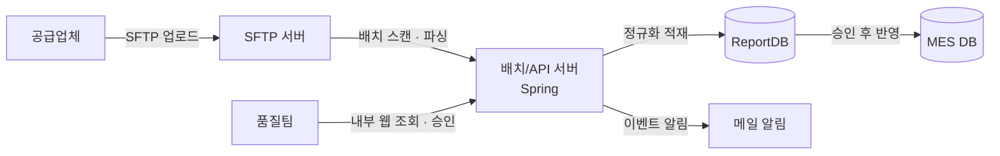
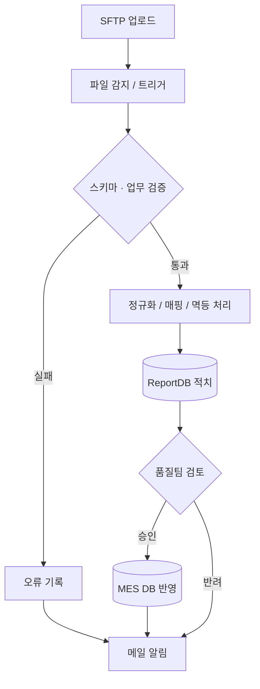
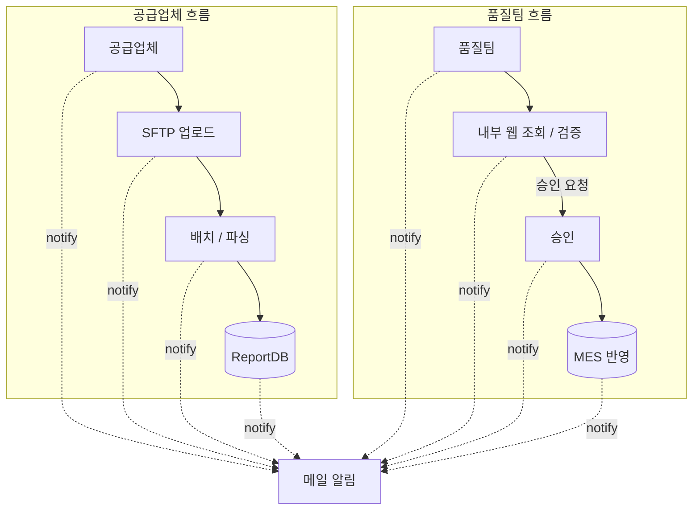
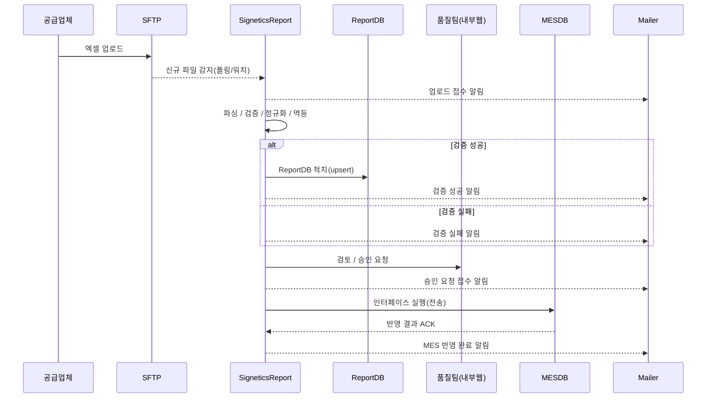

# CoA 데이터 수집·검증 시스템

공급업체 CoA 데이터를 SFTP 기반으로 자동 수집·검증·승인하는 시스템을 설계·구축해, 보안 리스크를 줄이고 품질팀 업무 효율과 데이터 신뢰성을 크게 향상시킨 프로젝트.

## 배경

CoA(Certificate of Analysis)는 자재 공급업체가 제공하는 자재 품질 데이터로, 반도체 패키징 생산 공정과 고객사 보고를 위해 필수적으로 관리되는 자료다. 기존에는 공급업체가 전달한 엑셀 파일을 품질팀이 수작업으로 취합·검증한 뒤 고객사에 제출하는 방식으로 운영되었는데, 이 과정에서 데이터 신뢰성이 떨어지고 오류 발생 가능성이 높다는 지적이 꾸준히 제기됐다. 고객사는 공급업체가 직접 데이터를 등록하고 품질팀은 이를 실시간으로 조회·검증하는 체계로의 전환을 요구했다.

## 해결하려던 문제

- 엑셀 기반 수작업 프로세스로 인한 데이터 정확성·추적성 저하
- 외부 공급업체가 내부망 웹 시스템에 직접 접속해야 한다는 초기 요구사항으로 인한 보안 정책 충돌
- 품질팀 인력이 데이터 검증·전송을 반복하면서 발생하는 업무 효율 저하와 재작업

## 목표

- 공급업체 데이터를 안전하게 수집·적치할 수 있는 구조 설계
- SFTP 업로드 및 서버 자동 파싱으로 데이터 입력 과정 표준화·자동화
- 품질팀이 웹 시스템을 통해 실시간으로 조회·검증할 수 있는 체계 마련
- 보안 리스크 최소화 및 데이터 신뢰성 확보

## 아키텍처

구성은 SFTP 서버 / 배치·API 서버(동일 서버) / ReportDB / MES DB로 이루어져 있다. 배치와 API는 별도 서버를 신설하지 않고 기존 Spring Framework 기반 내부 웹서버에 기능을 추가하는 방식으로 개발했다.

데이터 흐름은 업로드부터 검증, 승인, MES 반영까지 단계별로 분기하고, 모든 단계에서 메일 알림이 발생한다.

**이 구조를 선택한 이유**

- **보안·망 분리 준수**: 외부 업체의 내부망 웹 직접 접속 대신 SFTP 업로드로 단방향 수집 경로를 확보해 공격면을 최소화하고 감사를 쉽게 했다.
- **표준화·자동화**: 배치가 SFTP 파일을 정규화·검증한 뒤 ReportDB에 적치해, 사람이 하던 취합·검증 작업을 기계화했다.
- **품질 게이트**: ReportDB를 1차 적치·검증 레이어로 두고 승인된 데이터만 MES에 인터페이스해, 잘못된 데이터가 하류로 전파되는 것을 막았다.
- **감사 추적성**: 파일 원본, 파싱 로그, 검증 결과를 분리 저장해 이력 추적·재처리·원인 분석을 쉽게 했다.

**기술 스택 매핑**

- SFTP 서버: 사용자·키 관리, 업체별 업로드 디렉토리 분리
- 배치·API 서버(Spring): 배치는 스케줄·파일 파싱(Apache POI)·검증/정규화·멱등 키 처리, API는 품질팀 조회/승인·인터페이스 트리거·모니터링/에러 리포트 담당
- ReportDB: 1차 적치 스키마(원본/정규화/검증 상태 테이블)
- MES DB: 승인된 데이터만 최종 적치(인터페이스 테이블/프로시저)

## 비즈니스 플로우

공급업체와 품질팀, 두 축의 흐름이 각각 진행되다가 주요 이벤트마다 메일 알림으로 합류하는 구조다.

승인/반려, 오류 발생 시점을 시간 순서로 보면 다음과 같다.

## 담당한 일

- 요구사항 분석 후 비즈니스 플로우, 시스템 아키텍처, ERD 직접 설계
- 초기 "외부 접속 허용" 요구 대신 SFTP 업로드 기반 구조로 역제안해 보안 리스크 제거
- 원본 데이터 적치, 검증 상태 관리, 이벤트·알림 로그까지 포함한 정규화 스키마 설계 및 PL/SQL 프로시저 작성
- 품질팀 사용자 화면 설계부터 프런트엔드(Kendo UI/JavaScript), Spring MVC 기반 백엔드 API까지 단독 개발
- Apache POI 기반 Excel 파서 구현 및 검증 규칙 엔진화
- 업로드·검증·승인·적재 등 모든 이벤트에 대한 자동 메일 알림 기능 구축
- 배치 스케줄러, 오류 리포팅/모니터링 로그 체계 구축
- 인프라팀과 협의해 SFTP 포트 개방 및 디렉토리 정책 수립

## 기술 선택 이유

- **기존 인프라 재활용**: 신규 서버나 추가 리소스 확보가 불가능한 상황이라, 기존 Spring Framework 프로젝트에 기능을 추가하는 방식으로 구축했다.
- **Oracle 기반 최적화**: 기존 DB가 Oracle이었고 신규 DB 도입이 불가한 정책이라, PL/SQL로 일부 로직을 구현하고 MyBatis로 기존 연동을 최소화했다.
- **SFTP 채택**: 내부망 정책상 외부 접속 허용이 불가해, 웹 직접 입력 대신 SFTP 업로드 + 자동 파싱 구조로 설계했다.
- **단순함과 확장성의 병행**: 선택지가 많지 않았기 때문에 기존 리소스로 최대한 단순하게 만들되, 로그·이벤트 관리로 유지보수성을 확보했다.

## 트러블슈팅

초반에는 사용자 측 입력 오류(엑셀 헤더 오타, 시트명/열 순서 불일치, 필수값 누락, 병합 셀 등)로 업로드 실패가 빈번했다. 명세 전달이 부족했고, 검증 실패 메시지도 어떤 셀에서 왜 실패했는지 즉시 파악하기 어려운 수준이었다.

- 업체 공통 엑셀 템플릿을 배포해 필수 컬럼과 예시 데이터를 명확히 함
- 행/열 위치, 필드명, 기대값/실제값을 포함한 구체적인 오류 메시지로 사용자 자가 수정 유도
- 업로드 즉시 시트명·헤더·열 개수를 먼저 확인하는 사전 검증 단계 추가
- 오류 행은 스킵하고 정상 데이터는 계속 적재하는 방식으로 파싱/검증 로직 정리
- 템플릿 버전 관리와 월간 실패 사례 공유로 재발 방지

## 기술

- Java, Spring Framework, MyBatis
- Oracle, PL/SQL
- Apache POI
- Kendo UI, JavaScript
- Spring Scheduler, JavaMailSender/SMTP
- SFTP

## 결과

기존의 반복적인 수작업 취합·검증 과정을 SFTP 업로드 기반 단일 프로세스로 완전히 대체했다. 초반 파일 포맷 오류를 해결하며 시스템을 안정화한 이후로는 큰 장애 없이 운영되고 있으며, 승인 절차와 오류 리포트가 자동화되면서 품질팀의 업무 부담이 줄고 보고 자료의 신뢰도와 전달 속도도 함께 개선됐다. 내부 보안 정책을 지키면서 외부 업체 데이터를 수집하는 체계를 구현해 내부 보안 감사에서도 긍정적인 평가를 받았다.
