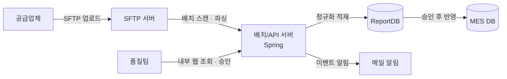
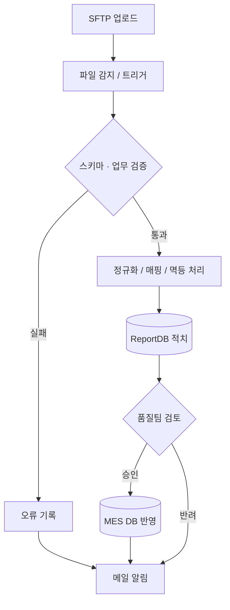

# CoA 데이터 수집·검증 시스템

공급업체 CoA 데이터를 SFTP 기반으로 자동 수집·검증·승인하는 시스템을 설계·구축해, 보안 리스크를 줄이고 품질팀 업무 효율과 데이터 신뢰성을 크게 향상시킨 프로젝트.

## 배경

CoA(Certificate of Analysis)는 자재 공급업체가 제공하는 자재 품질 데이터로, 반도체 패키징 생산 공정과 고객사 보고를 위해 필수적으로 관리되는 자료다. 기존에는 공급업체가 전달한 엑셀 파일을 품질팀이 수작업으로 취합·검증한 뒤 고객사에 제출하는 방식으로 운영되었는데, 이 과정에서 데이터 신뢰성이 떨어지고 오류 발생 가능성이 높다는 지적이 꾸준히 제기됐다. 고객사는 공급업체가 직접 데이터를 등록하고 품질팀은 이를 실시간으로 조회·검증하는 체계로의 전환을 요구했다.

## 해결하려던 문제

- 엑셀 기반 수작업 프로세스로 인한 데이터 정확성·추적성 저하
- 외부 공급업체가 내부망 웹 시스템에 직접 접속해야 한다는 초기 요구사항으로 인한 보안 정책 충돌
- 품질팀 인력이 데이터 검증·전송을 반복하면서 발생하는 업무 효율 저하와 재작업

## 접근 방식

외부 공급업체가 내부망에 직접 접속하는 대신, SFTP 업로드 → 서버 자동 파싱·검증 → 품질팀 승인 → MES 반영으로 이어지는 단방향 수집 구조를 역제안했다. 원본 데이터, 검증 결과, 승인 이력을 분리 저장해 감사·추적성과 재처리 용이성을 함께 확보했다.

## 데이터 흐름

## 담당한 일

- 요구사항 분석 후 비즈니스 플로우, 시스템 아키텍처, ERD 직접 설계
- 초기 "외부 접속 허용" 요구 대신 SFTP 업로드 기반 구조로 역제안해 보안 리스크 제거
- 원본 데이터 적치, 검증 상태 관리, 이벤트·알림 로그까지 포함한 정규화 스키마 설계 및 PL/SQL 프로시저 작성
- 품질팀 사용자 화면 설계부터 프런트엔드(Kendo UI/JavaScript), Spring MVC 기반 백엔드 API까지 단독 개발
- Apache POI 기반 Excel 파서 구현 및 검증 규칙 엔진화
- 업로드·검증·승인·적재 등 모든 이벤트에 대한 자동 메일 알림 기능 구축
- 배치 스케줄러, 오류 리포팅/모니터링 로그 체계 구축
- 인프라팀과 협의해 SFTP 포트 개방 및 디렉토리 정책 수립

## 주요 의사결정

### SFTP 업로드 채택

외부망에서 내부망으로의 직접 접근을 차단하고 단방향 수집 구조로 전환해 보안 리스크를 줄였다. 신규 서버를 두는 대신 기존 Spring WAS를 확장하는 방식을 택해 구축 비용과 운영 부담도 최소화했다.

### ReportDB → MES DB 2단계 구조

1차 적치(ReportDB)와 최종 반영(MES DB)을 분리해, 오류·불량 데이터가 생산 시스템으로 바로 전파되는 것을 막고 승인된 데이터만 하류로 흘러가도록 했다.

## 트러블슈팅

초반에는 사용자 측 입력 오류(엑셀 헤더 오타, 시트명/열 순서 불일치, 필수값 누락, 병합 셀 등)로 업로드 실패가 빈번했다. 명세 전달이 부족했고, 검증 실패 메시지도 어떤 셀에서 왜 실패했는지 즉시 파악하기 어려운 수준이었다.

- 업체 공통 엑셀 템플릿을 배포해 필수 컬럼과 예시 데이터를 명확히 함
- 행/열 위치, 필드명, 기대값/실제값을 포함한 구체적인 오류 메시지로 사용자 자가 수정 유도
- 업로드 즉시 시트명·헤더·열 개수를 먼저 확인하는 사전 검증 단계 추가
- 오류 행은 스킵하고 정상 데이터는 계속 적재하는 방식으로 파싱/검증 로직 정리
- 템플릿 버전 관리와 월간 실패 사례 공유로 재발 방지

## 기술

- Java, Spring Framework, MyBatis
- Oracle, PL/SQL
- Apache POI
- Kendo UI, JavaScript
- Spring Scheduler, JavaMailSender/SMTP
- SFTP

## 결과

기존의 반복적인 수작업 취합·검증 과정을 SFTP 업로드 기반 단일 프로세스로 완전히 대체했다. 초반 파일 포맷 오류를 해결하며 시스템을 안정화한 이후로는 큰 장애 없이 운영되고 있으며, 승인 절차와 오류 리포트가 자동화되면서 품질팀의 업무 부담이 줄고 보고 자료의 신뢰도와 전달 속도도 함께 개선됐다. 내부 보안 정책을 지키면서 외부 업체 데이터를 수집하는 체계를 구현해 내부 보안 감사에서도 긍정적인 평가를 받았다.
