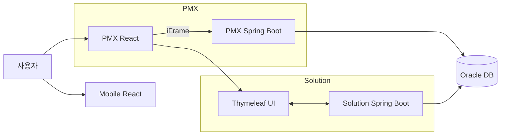
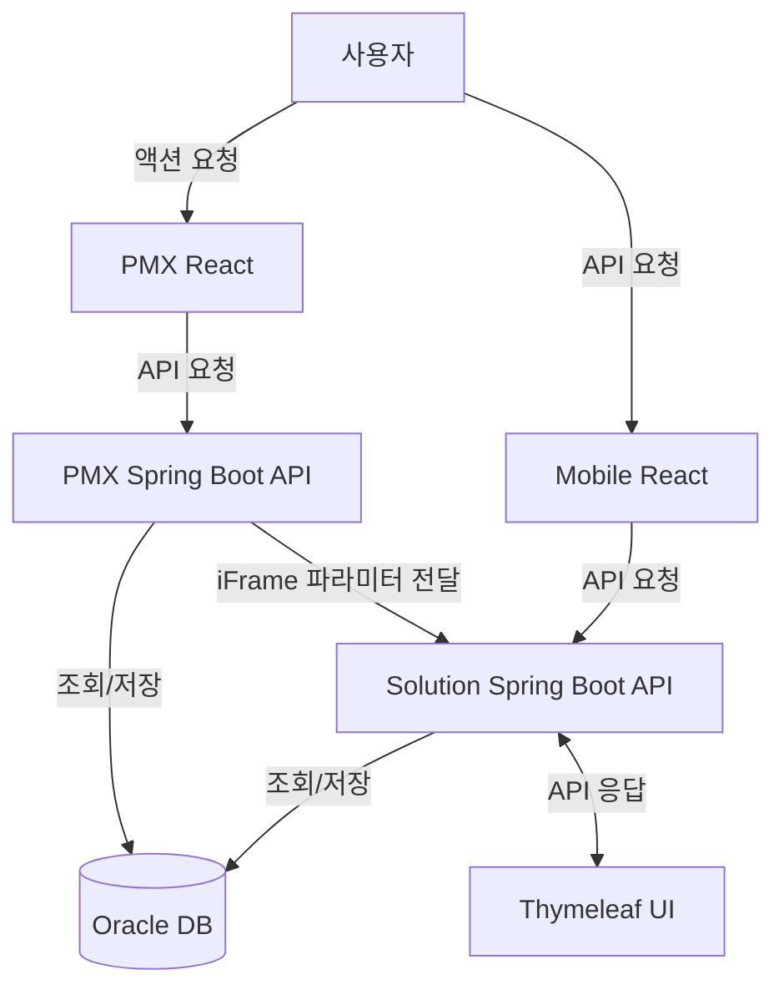
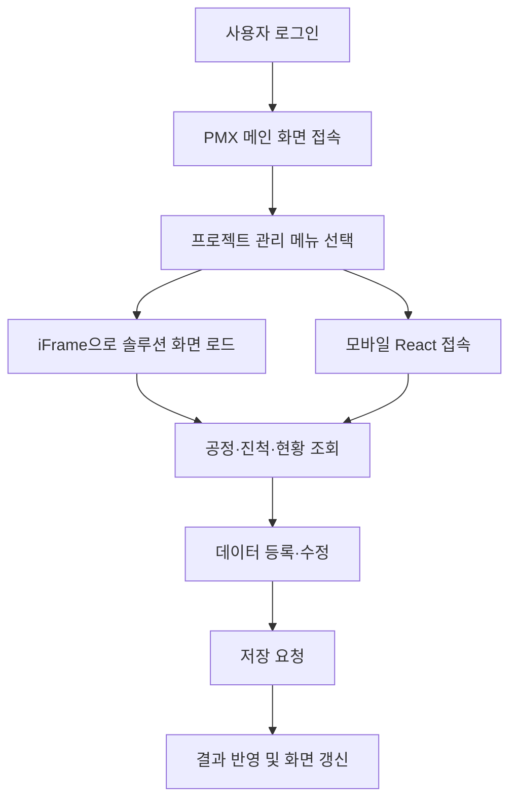
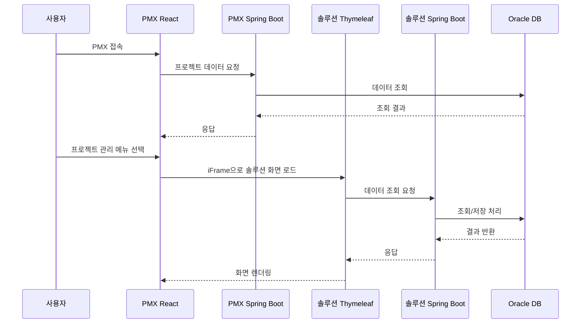

# GS건설 프로젝트 관리 시스템 구축

대기업 건설사 프로젝트 관리 시스템 신규 구축 과정에서 기존 MSSQL 기반 솔루션을 Oracle 환경으로 전환하고, 고객사 표준 아키텍처에 맞춰 기능 커스터마이징과 안정화를 수행한 프로젝트.

## 배경

GS건설 프로젝트 관리 시스템(PMX)은 다수의 현장과 협력사가 참여하는 건설 프로젝트의 공정·진척·현황 정보를 통합 관리하기 위해 신규로 구축된 내부 시스템이다. 본 프로젝트에서는 PMX 시스템 신규 구축과 함께, 기존 채움솔루션 PM 솔루션을 GS건설 표준 환경에 맞게 적용해야 했으며, 이를 위해 Oracle DB 및 iFrame 기반 통합 구조로의 전환이 필요했다.

## 해결하려던 문제

- 기존 솔루션이 MSSQL 기반으로 GS건설 표준 DB(Oracle)와 불일치
- iFrame 기반 통합 구조에서 기존 화면·데이터 연동 방식을 그대로 적용 불가
- 신규 구축 단계에서 고객사 요구사항이 지속적으로 추가·변경
- 초기 구축 단계에서 발생 가능한 연동 오류 및 데이터 정합성 이슈

## 목표

- 기존 솔루션을 Oracle DB 환경으로 전환해 고객사 표준에 맞게 이식
- iFrame 기반 구조에서도 안정적으로 동작하는 화면·데이터 연동 방식 구현
- 고객사 요구사항을 반영한 기능 확장 및 커스터마이징
- 신규 구축 초기 단계에서 운영 가능한 수준의 안정성 확보

## 아키텍처

구성은 GS건설 PMX 시스템 / iFrame 기반 솔루션 화면 / Spring Boot WAS / Oracle DB로 이루어져 있다. 솔루션은 단독 실행이 아니라, 신규 구축되는 GS건설 PMX 시스템 내부 iFrame 구조에서 구동되도록 설계됐다.

**기술 스택 매핑**

- Backend: Java, Spring Boot, MyBatis
- DB: Oracle DB, PL/SQL / MSSQL(기존 솔루션 구조 분석 및 전환)
- Frontend: Thymeleaf, JavaScript, React(모바일 환경), iFrame 기반 시스템 통합

## 비즈니스 플로우

사용자가 PMX에 로그인해 프로젝트 관리 메뉴를 선택하면 iFrame으로 솔루션 화면이 로드되고(모바일은 React 앱으로 별도 접속), 공정·진척·현황을 조회하고 등록·수정한 내용이 저장된다.

PMX 접속부터 솔루션 화면 렌더링까지 시간 순서로 보면 다음과 같다.

## 담당한 일

- GS건설 PMX 시스템 신규 구축을 위한 백엔드 개발 담당
- 기존 MSSQL 기반 솔루션 구조 분석 및 Oracle DB 전환: SQL 문법·데이터 타입 차이 분석, 쿼리 및 데이터 처리 로직 재작성
- iFrame 기반 구조에 맞춘 화면·데이터 연동 방식 조정
- 고객사 요구사항에 따른 기능 커스터마이징 개발
- 솔루션 적용 과정에서 발견된 기존 기능 오류 및 비정합 항목 수정
- 현업과 협업하며 요구사항 변경 사항 반영 및 초기 안정화 작업 수행

## 기술

- Java, Spring Boot, MyBatis
- Oracle DB, PL/SQL, MSSQL
- Thymeleaf, JavaScript, React
- iFrame 기반 시스템 통합

## 결과

기존 MSSQL 기반 솔루션을 Oracle 환경으로 안정적으로 전환했고, iFrame 기반 통합 구조에서도 정상 동작하는 형태로 솔루션 이식을 완료했다. 신규 구축 초기 단계에서 발생할 수 있는 주요 연동 이슈를 사전에 해결해 안정화에 기여했으며, 고객사 요구사항을 반영한 기능 개선으로 현업 사용 적합도를 높였다. 개발 완료 후 인수인계를 통해 후속 개발·운영이 가능한 상태로 정리했다.
