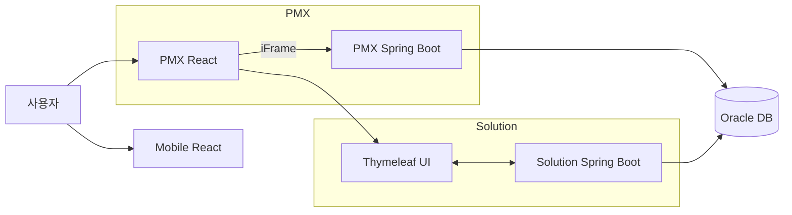
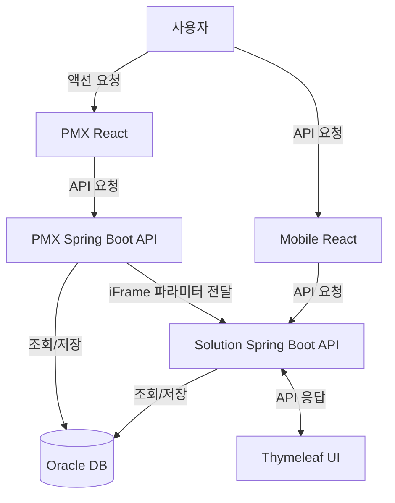
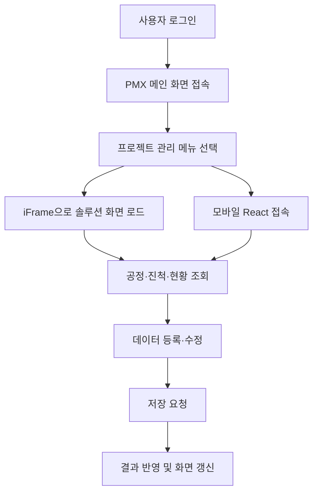
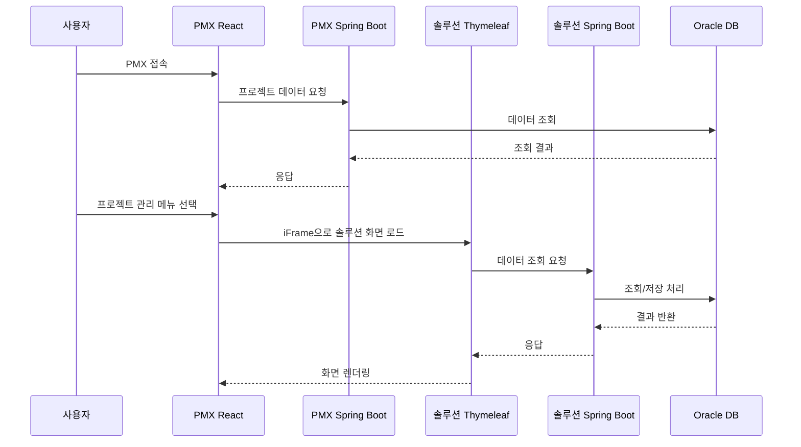

# GS건설 프로젝트 관리 시스템 구축

프로시저 중심으로 동작하던 MSSQL 기반 진척·이슈 관리 솔루션을 GS건설 표준인 Oracle 환경으로 옮기고, 새로 구축되는 PMX에 iFrame으로 통합한 프로젝트.

## 배경

GS건설이 발주해 신규로 구축하는 프로젝트 관리 시스템 PMX에는 여러 업무 솔루션이 들어가게 되어 있었고, 그중 하나가 건설 현장의 진척도와 이슈 등을 관리하는 PM 솔루션이었다. 이 솔루션은 채움솔루션의 제품이었고, 현장, 협력사, 본사 관리자 등 건설 프로젝트에 참여하는 사람들이 두루 사용하는 구조였다. 업무는 솔루션 납품과 현장 파견이 함께 이뤄지는 형태로 진행했다.

문제는 이 솔루션이 MSSQL 기반이라는 점이었다. GS건설 표준 DB는 Oracle이었고, PMX 안에 iFrame으로 들어가야 한다는 구조도 정해져 있었다. 게다가 솔루션은 계산과 데이터 조회까지 대부분이 DB의 프로시저로 구현되어 있어서, 단순히 접속 정보만 바꾸는 이식이 아니라 솔루션의 핵심 로직을 Oracle PL/SQL로 다시 옮기는 작업이 필요했다.

## 해결하려던 문제

- 솔루션의 로직 대부분이 MSSQL 프로시저에 들어 있어, Java 쪽 코드를 고치는 것으로는 해결되지 않음
- MSSQL에만 있거나 동작이 다른 함수와 타입이 많아 Oracle에서 그대로 쓸 수 없음
- iFrame 안에서 동작하는 솔루션이 PMX의 인증을 넘겨받아야 하고, 이 과정에서 세션 처리가 맞지 않음
- 신규 구축 단계라 요구사항이 계속 추가·변경됨

## 목표

- 솔루션의 프로시저와 쿼리를 Oracle PL/SQL로 변환해 GS건설 표준 DB 환경에서 동작하도록 이식
- iFrame 안에서도 PMX 인증을 넘겨받아 안정적으로 동작하는 화면·세션 연동 구현
- 고객사 요구사항을 반영한 기능 커스터마이징
- 신규 구축 초기 단계에서 운영 가능한 수준의 안정성 확보

## 아키텍처

구성은 GS건설 PMX 시스템 / iFrame 기반 솔루션 화면 / Spring Boot WAS / Oracle DB로 이루어져 있다. 솔루션은 단독 실행이 아니라, 신규 구축되는 GS건설 PMX 시스템 내부 iFrame 구조에서 구동되도록 설계됐다.

```mermaid
flowchart LR
    U[사용자] --> PR[PMX React]
    U --> MR[Mobile React]
    subgraph PMX
        PR -->|iFrame| PB[PMX Spring Boot]
    end
    PR --> TU[Thymeleaf UI]
    subgraph Solution
        TU <--> SB[Solution Spring Boot]
    end
    PB --> DB[(Oracle DB)]
    SB --> DB
```

```mermaid
flowchart TD
    U[사용자] -->|액션 요청| PR[PMX React]
    PR -->|API 요청| PA[PMX Spring Boot API]
    PA -->|조회/저장| DB[(Oracle DB)]
    PA -->|iFrame 파라미터 전달| SA[Solution Spring Boot API]
    SA -->|조회/저장| DB
    SA <-->|API 응답| TU[Thymeleaf UI]
    U -->|API 요청| MR[Mobile React]
    MR -->|API 요청| SA
```

**기술 스택 매핑**

- Backend: Java, Spring Boot, MyBatis
- DB: Oracle DB, PL/SQL / MSSQL(기존 솔루션 구조 분석 및 전환)
- Frontend: Thymeleaf, JavaScript, React(모바일 환경), iFrame 기반 시스템 통합
- Session: Redis 세션 (PMX 인증 연동)

## 비즈니스 플로우

사용자가 PMX에 로그인해 프로젝트 관리 메뉴를 선택하면 iFrame으로 솔루션 화면이 로드되고(모바일은 React 앱으로 별도 접속), 공정·진척·현황을 조회하고 등록·수정한 내용이 저장된다.

```mermaid
flowchart TD
    A[사용자 로그인] --> B[PMX 메인 화면 접속]
    B --> C[프로젝트 관리 메뉴 선택]
    C --> D[iFrame으로 솔루션 화면 로드]
    C --> E[모바일 React 접속]
    D --> F[공정·진척·현황 조회]
    E --> F
    F --> G[데이터 등록·수정]
    G --> H[저장 요청]
    H --> I[결과 반영 및 화면 갱신]
```

PMX 접속부터 솔루션 화면 렌더링까지 시간 순서로 보면 다음과 같다.

```mermaid
sequenceDiagram
    participant U as 사용자
    participant PR as PMX React
    participant PB as PMX Spring Boot
    participant ST as 솔루션 Thymeleaf
    participant SB as 솔루션 Spring Boot
    participant DB as Oracle DB

    U->>PR: PMX 접속
    PR->>PB: 프로젝트 데이터 요청
    PB->>DB: 데이터 조회
    DB-->>PB: 조회 결과
    PB-->>PR: 응답

    U->>PR: 프로젝트 관리 메뉴 선택
    PR->>ST: iFrame으로 솔루션 화면 로드
    ST->>SB: 데이터 조회 요청
    SB->>DB: 조회/저장 처리
    DB-->>SB: 결과 반환
    SB-->>ST: 응답
    ST-->>PR: 화면 렌더링
```

## 담당한 일

- GS건설 PMX에 들어가는 PM 솔루션의 백엔드 개발 담당(납품·파견 병행)
- **MSSQL → Oracle 전환**: 솔루션이 프로시저 중심이어서, 계산과 데이터 조회를 담당하던 프로시저와 쿼리를 PL/SQL로 하나씩 변환. MSSQL에만 있는 함수와 타입, 문법 차이를 Oracle에 맞게 바꿔 다시 작성
- **iFrame 연동**: PMX에서 인증을 넘겨받는 흐름을 맞추고, Redis 세션 환경에서 iFrame 인증 이후의 세션 처리 문제를 조정
- 고객사 요구사항에 따른 기능 커스터마이징
- 솔루션 적용 과정에서 발견된 기존 기능 오류와 비정합 항목 수정
- 현업과 협업하며 요구사항 변경 반영 및 초기 안정화

## 트러블슈팅

초기 구축 단계에서는 하루하루가 오류 대응이었다고 해도 될 만큼 문제가 많았고, 크게는 두 갈래였다.

**1. 프로시저 중심 구조의 DB 이식**

- **상황**: 솔루션은 시스템상의 계산과 조회 대부분을 DB 프로시저로 처리했다. Java에서 로직이 돌아가는 구조였다면 DB 종류와 무관하게 연동할 수 있었겠지만, 로직이 DB 안에 있어서 사실상 처음부터 끝까지 변환해야 했다.
- **문제**: MSSQL에서 쓰던 함수 중 Oracle에 없거나 동작이 다른 것이 많았고, 데이터 타입 차이도 컸다. 변환 과정과 이후 테스트에서 오류가 끊이지 않았다.
- **조치**: 프로시저를 하나씩 PL/SQL로 변환하고, 시스템을 실제로 돌려 가며 화면과 기능이 정상 동작하는지 확인해 문제를 잡아나갔다.

**2. iFrame 환경의 세션 인증**

- **상황**: 솔루션은 PMX에서 인증을 넘겨받아야 했고, 세션은 Redis를 사용하고 있었다.
- **문제**: iFrame을 통해 세션 인증을 받은 뒤 솔루션 쪽으로 접근하면 세션 인증이 막히는 현상이 있었다.
- **조치**: 인증을 넘겨받고 세션을 유지하는 연동 방식을 조정해 iFrame 안에서도 정상 동작하도록 맞췄다.

## 배운 점

로직이 DB 프로시저에 깊게 들어 있는 솔루션은 DB 제품을 바꾸는 순간 사실상 전체를 다시 작성해야 한다. 이 프로젝트에서 그 비용을 직접 겪으면서, 가능하면 비즈니스 로직은 애플리케이션 코드에 두고 DB 의존도를 낮추는 쪽이 이식성과 유지보수 면에서 낫다고 생각하게 됐다.

## 기술

- Java, Spring Boot, MyBatis
- Oracle DB, PL/SQL, MSSQL
- Redis (세션)
- Thymeleaf, JavaScript, React
- iFrame 기반 시스템 통합

## 결과

MSSQL 기반이던 솔루션을 Oracle 환경으로 전환해, GS건설 표준 환경에서 동작하는 형태로 이식을 마쳤다. iFrame 기반 통합 구조에서 PMX 인증을 받아 동작하도록 연동했고, 신규 구축 초기에 발생한 연동 이슈를 해결해 안정화에 기여했다. 맡은 범위의 개발을 모두 마무리한 뒤 프로젝트를 종료했다.
