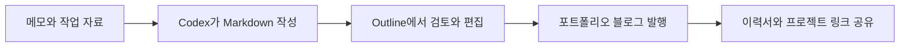

# Neverland

## 배경

작업 결과만 나열하는 포트폴리오와 시간순으로 흘러가는 블로그를 따로 운영하지 않고, 실제 문제를 해결한 과정과 배운 점이 프로젝트 경험으로 이어지는 공간이 필요했다.

## 해결하려던 문제

- 글쓰기는 편해야 하지만 공개 화면은 개인적인 인상을 가져야 한다.
- 작업 기록과 대표 프로젝트가 서로 분리되지 않아야 한다.
- 글이 쌓여도 태그, 연도, 검색으로 다시 찾을 수 있어야 한다.
- 개인 서버에서도 백업하고 이전할 수 있어야 한다.

## 접근 방식

Markdown 파일과 Outline을 함께 콘텐츠 원본으로 사용한다. Codex가 Markdown을 작성해 Outline에 올리거나 사용자가 외부에서 Outline을 직접 편집하면, 같은 주소의 공개 포트폴리오 화면에 반영된다. GitHub `main`의 Markdown은 Azure Static Web Apps 무료 플랜에도 정적 백업으로 자동 배포된다.

## 구현 내용

- Markdown frontmatter 기반 콘텐츠 관리
- Outline 기반 외부 작성 환경과 Markdown 업로드 자동화
- Node.js 동적 블로그와 정적 사이트 생성기
- GitHub 기반 정적 백업 자동 배포
- 포트폴리오형 반응형 블로그 홈
- 글과 프로젝트 목록·상세 정적 생성
- 카테고리, 태그, 연도 아카이브와 통합 검색
- RSS, sitemap, robots와 기본 SEO 메타데이터
- Mermaid 설계도 렌더링
- 기존 Azure VM, 무료 DNS와 Let’s Encrypt를 재사용한 추가 비용 0원 구조

## 기술

- Markdown
- Outline
- Docker Compose
- Node.js
- GitHub Actions
- Azure Static Web Apps

## 다음 단계

- 실제 프로필과 대표 프로젝트 확장
- GitHub 활동 연동
- 짧은 개인 도메인 연결과 소셜 공유 이미지 개선
- Markdown 작성 템플릿과 미리보기 개선
