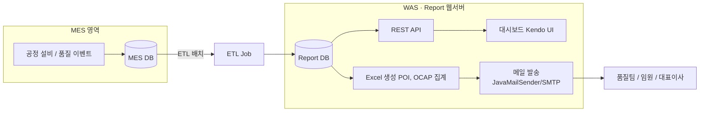
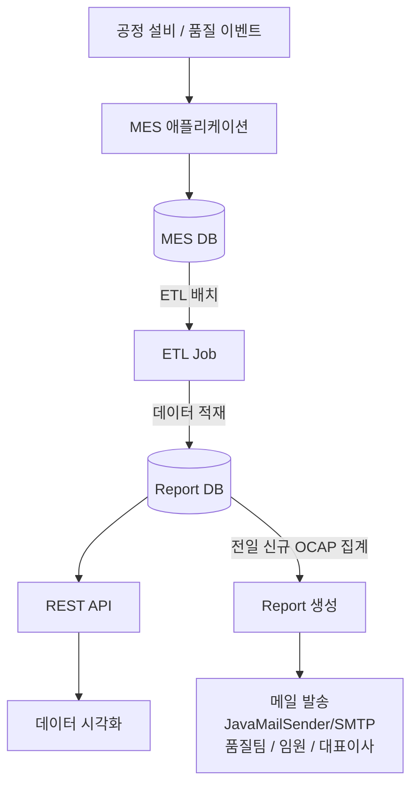
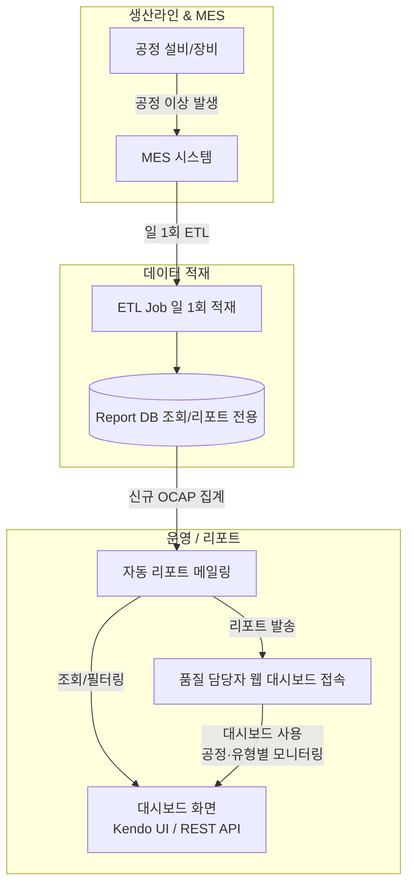
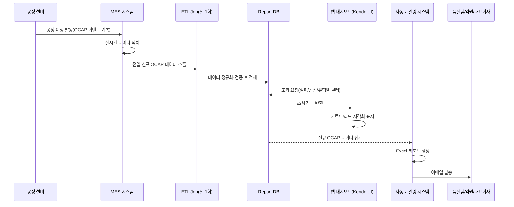

# OCAP 품질 이상 대응 시스템

품질 이상 징후를 실시간 대시보드로 가시화하고, 주기 리포트를 자동 메일링해 대응 누락을 줄여 조치 리드타임을 단축한 프로젝트.

## 배경

OCAP(Out of Control Action Plan) 시스템은 공정 이상 대응 프로세스를 표준화하고 가시화하기 위해 시작됐다. 기존에는 각 공정에서 발생한 이상 데이터를 담당자가 수기로 취합해 주간·월간 보고서에 반영했는데, 이 과정이 늦어지거나 누락되면서 신속한 대응이 어려웠다. 또한 보고서가 부서마다 다른 형식으로 작성되어 이슈 추적과 개선 활동이 제대로 연결되지 못했다.

## 해결하려던 문제

- 실시간 모니터링 부재로 초기 대응 타이밍 상실
- 보고서 작성과 전달이 수작업 중심이라 지연·누락 발생
- 이슈 및 조치 이력의 추적성 부족

## 목표

- 공정·품질 지표의 실시간 대시보드 제공
- 자동 리포트 메일링으로 보고 표준화·누락 방지
- 이슈 → 조치 → 결과의 흐름 가시화 및 추적성 강화

## 아키텍처

구성은 MES DB / ETL / Report DB / WAS / Kendo UI로 이루어져 있다. 생산이력관리 DB(MES DB)에 직접 접근하지 않고 ETL을 통해 일일 동기화함으로써 운영 DB 부하와 보안 리스크를 최소화하고, 스케줄러 기반 일괄 보고 체계로 보고 품질과 대응 속도를 표준화했다.

전체 데이터 흐름은 MES에서 발생한 이상 이벤트가 ETL로 일 1회 적재되고, 이를 REST API와 자동 리포트 양쪽에서 활용하는 구조다.

**이 구조를 선택한 이유**

- 기존에는 각 공정별 이상 데이터를 현장 담당자가 수작업으로 취합·보고해 대응 지연·누락 문제가 지속됐다.
- 실시간 이상 감지 및 대응 지표를 가시화하고, 보고서를 자동화해 조치 리드타임을 단축할 필요가 있었다.
- MES(운영 DB)를 직접 조회할 경우 실시간 생산 데이터에 부하·보안 리스크가 커서, ETL 기반의 리포트 전용 DB로 데이터를 분리했다.
- 리포트 전용 환경과 자동 메일링 프로세스를 구축해 반복 작업을 최소화하고 보고·대응 품질을 높이기 위해 이 구조를 선택했다.

**기술 스택 매핑**

- Backend: Java, Spring Framework, MyBatis
- Frontend: JavaScript, Kendo UI (Grid, Chart)
- Database: Report DB, MES DB(Oracle)
- ETL & Scheduler: ETL, Spring Scheduler(일일 배치, 자동 보고)
- Reporting: Apache POI(Excel 생성), JavaMailSender/SMTP(메일 발송)

## 비즈니스 플로우

생산라인에서 발생한 공정 이상이 ETL로 하루 한 번 적재되고, 품질 담당자는 대시보드로 조회하거나 자동 발송되는 리포트 메일로 확인한다.

시간 순서로 보면 ETL 배치가 전일 데이터를 집계해 대시보드 조회와 자동 메일 발송 양쪽으로 흘러간다.

## 담당한 일

- ETL 기반 데이터 적재 및 활용 체계 구축: MES에서 적재된 공정 이상 데이터를 ETL로 Report DB에 일일 동기화해 리포트·대시보드에서 활용할 수 있는 환경 구축
- 백엔드 API 개발: Report DB 기반으로 Kendo UI 대시보드와 연동되는 RESTful API 개발, 일·주·월별 지표와 공정별·유형별 통계 데이터 조회, Pareto Chart 분석용 데이터 세트 제공
- 프런트엔드 시각화 대시보드 구현: Kendo Grid·Chart로 주요 지표를 직관적으로 조회할 수 있는 화면 개발, 날짜/공정별 필터와 Pareto Chart 등 시각화 기능 구현, 대시보드 UI 간소화로 보고용 데이터 확인과 조치 현황 추적을 쉽게 함
- 자동 리포트 메일링 시스템 구축: 매일 오전 8시 스케줄러가 신규 발생 건·조치 미완료 건을 집계해 Excel 리포트를 생성하고 품질팀·임원·대표이사에게 자동 메일 발송, Apache POI로 보고서 서식 표준화, JavaMailSender로 안정적인 메일 전송 구현
- 운영·유지보수 효율성 개선: 배치·메일링 로직 오류 발생 시 로그를 남기고 예외 처리·모니터링 체계 강화, 현업 피드백을 반영해 UI/UX 개선 및 필터 기능 보완

## 기술 선택 이유

- **Spring Scheduler**: 일정 주기로 리포트 생성·메일 발송을 자동화해 운영 개입을 최소화했다.
- **Kendo UI(Grid, Chart)**: 현업 사용자가 즉시 활용할 수 있는 직관적인 대시보드와 필터링·시각화 기능을 제공했다.
- **Apache POI**: 리포트 Excel 문서를 표준화·자동 생성해 별도 툴 없이 현업이 바로 활용할 수 있게 했다.
- **JavaMailSender / SMTP**: 안정적인 메일 발송과 에러 핸들링을 구현했다.
- **Oracle Report DB + ETL**: 운영 DB 부하를 차단하고 레포트 데이터 환경을 분리해 성능·보안·유지보수성을 확보했다.
- **Spring Framework + MyBatis**: 안정성과 생산성이 검증된 조합으로 REST API 개발과 SQL 최적화에 적합했다.

## 트러블슈팅

오픈 이후 장애나 치명적 이슈 없이 안정적으로 운영됐다. 다만 테스트 단계에서 Kendo Grid에 가변 컬럼(날짜 기반)을 매핑할 때, 컬럼명이 숫자로 시작하는 경우 바인딩이 실패하는 문제를 확인했다.

- **원인 & 조치**: 컬럼 키를 문자 프리픽스(예: `D_2024_10_03`)로 변환하고 Grid의 schema/columns 매핑을 일관화해 바인딩을 정상화했다.
- **재발 방지**: 가변 컬럼 네이밍 규칙을 수립하고 단위 테스트·데이터 유효성 검사를 추가해 사전 탐지를 강화했다.
- **결과**: 사전 테스트 강화로 출시 후 무중단 운영을 유지했고, 이후 개선은 시각화(차트 구성) 수준에 국한됐다.

## 기술

- Java, Spring Framework, MyBatis
- Oracle
- Kendo UI (Grid, Chart)
- Apache POI
- Spring Scheduler, JavaMailSender/SMTP

## 결과

개발 완료 후 장애 발생 사례 없이 안정적으로 운영됐고, 추가 요청은 일부 차트 구성 등 확장 기능에 국한됐다. 대시보드는 대표이사 주관 임원 회의에서 품질 지표 참고 자료로 활용될 만큼 신뢰성을 확보했으며, 팀장에게 성과를 인정받아 퇴사 시점까지 추가 개선 요청 없이 안정적으로 유지됐다. 자동 메일링과 표준화된 대시보드로 품질 대응 및 보고 프로세스가 단순화되며 업무 부담이 줄었다.
