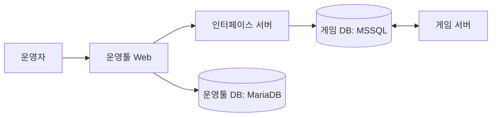
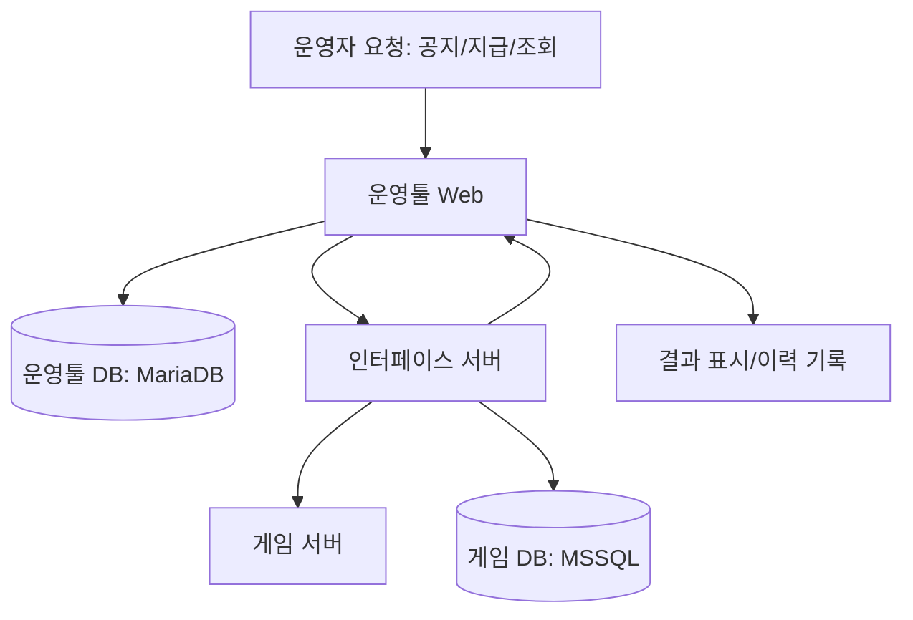
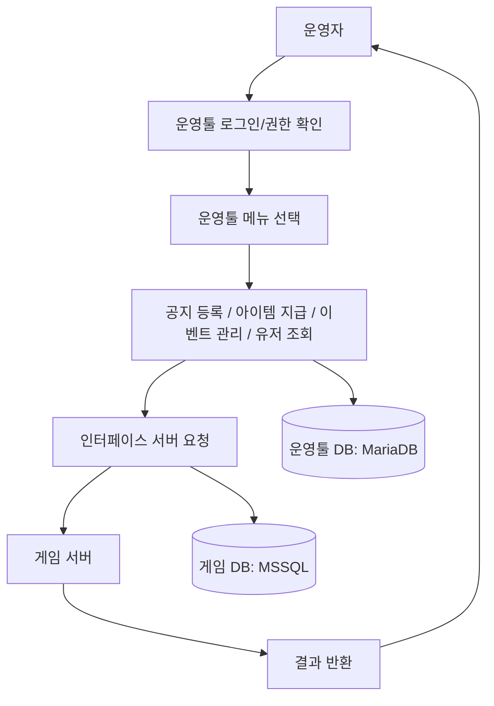
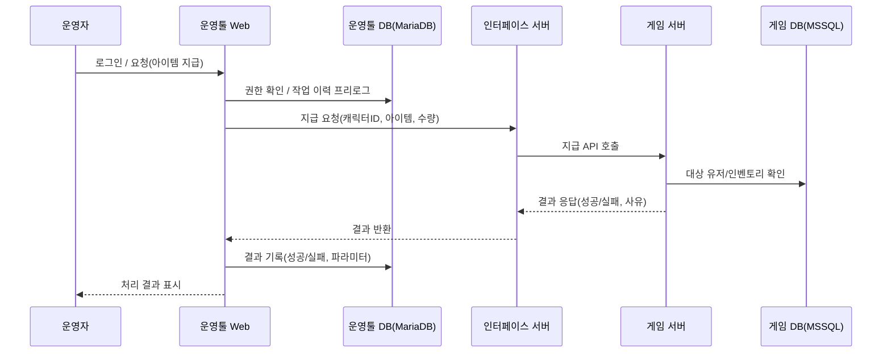
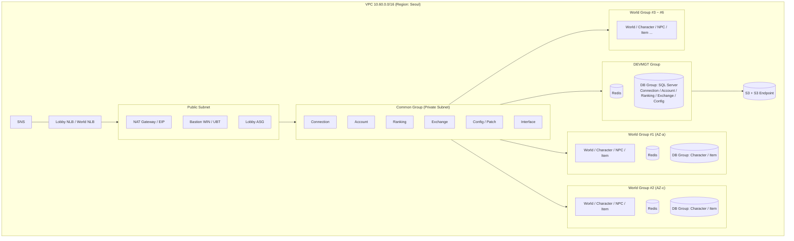

# 열혈강호 W 운영툴

개발자로서의 첫 실무 프로젝트로, 게임 운영 효율화를 위해 각종 데이터 관리·운영 기능을 구현하며 실무 역량을 키운 경험.

## 배경

열혈강호 W 운영툴은 게임 서비스 운영 효율화를 위해 설계된 별도의 웹 기반 관리 시스템이다. 게임 서버는 외부 접근이 불가능하도록 설계되어 있었기 때문에, AWS 기반의 3티어 아키텍처(웹 서버–인터페이스 서버–DB 서버) 구조로 분리 운영되었다. 운영자는 이 툴을 통해 게임 내 공지 등록, 특정 캐릭터 대상 아이템 지급, 이벤트 관리, 유저 데이터 조회 등의 작업을 수행했으며, 운영툴에서의 요청은 인터페이스 서버를 통해 게임 서버와 통신하도록 구성되었다.

## 해결하려던 문제

- 게임 출시 전 단계라 운영툴이 전혀 없는 상태였고, 게임 운영 준비를 위해 기본적인 운영툴을 신규로 구축해야 하는 상황이었다
- 공지 등록, 아이템 지급, 유저 데이터 조회 등 운영팀 필수 기능을 사전 확보할 필요가 있었다
- 안정적인 3티어 아키텍처와 보안 정책을 반영해 운영툴–게임 서버 간 통신 구조로 개발해야 했다

## 목표

- 게임 출시 전 필수 운영 기능 확보: 공지 등록, 아이템 지급, 이벤트 관리, 유저 데이터 조회 등 운영팀 핵심 기능을 웹 기반으로 제공
- 보안 정책 준수: AWS 3티어 아키텍처 구조로 개발
- 운영 효율성 확보: 운영자가 서버에 직접 접속하지 않고 대부분의 운영 작업을 처리할 수 있는 환경 구축
- 확장성 고려: 신규 이벤트나 시스템 확장을 고려해 메뉴 구조와 인터페이스를 유연하게 설계

## 아키텍처

구성은 운영툴 Web / 인터페이스 서버 / 게임 서버 / 운영툴 DB(MariaDB) / 게임 DB(MSSQL)로 이루어져 있다. 게임 서버는 외부에 비공개이며, 운영툴 요청은 인터페이스 서버를 통해서만 전달된다.

**이 구조를 선택한 이유**

보안 분리 및 인터페이스 서버 사용 등 전체 구조는 사내 표준 아키텍처 설계를 기반으로 했다. 본인은 이 아키텍처 위에서 운영툴 Web 서버 기능 개발과 화면 구현을 담당했으며, 운영자가 서버 접근 없이 핵심 작업을 처리할 수 있도록 운영툴 메뉴·기능을 구현해 운영 효율성 확보에 기여했다.

**기술 스택 매핑**

- 운영툴 Web Backend: Java, Spring Framework(전자정부프레임워크), MyBatis
- 운영툴 Web Frontend/UI: JSP, JS 컴포넌트
- 주요 기능: 공지 등록, 아이템 지급, 이벤트 관리, 유저 검색/조회
- 권한 관리/로그: 작업 이력 기록, 권한 레벨별 접근 제어
- DB: MariaDB(운영툴 메뉴 구성/작업 이력), MSSQL(게임 연동 조회/아이템 지급 대상 데이터)

## 비즈니스 플로우

운영자가 로그인해 권한을 확인하고 메뉴를 선택하면, 인터페이스 서버를 거쳐 게임 서버/DB와 통신한 뒤 결과가 반환된다.

아이템 지급을 예로 든 시간 순서 흐름은 다음과 같다.

## 담당한 일

- 운영툴 Web 개발: 공지 등록, 아이템 지급, 이벤트 관리, 유저 검색 등 주요 운영 기능 화면 및 백엔드 API 개발, 운영자 권한별 메뉴 접근 제어 및 작업 이력 기록 기능 구현
- 프런트엔드/UI 작업: JSP, JavaScript, jQuery 등으로 운영자가 쉽게 사용할 수 있는 UI 컴포넌트 개발 및 유지보수
- 쿼리 작성 및 데이터 연동: MSSQL 기반 게임 데이터 조회/아이템 지급 로직 연동
- 버그 수정·유지보수: 게임 오픈 준비 단계에서 빈번히 발생한 화면 오류, 데이터 조회 오류 등을 분석 및 수정
- 운영팀 지원: 운영팀과 협력해 기능 요청사항을 반영하고 운영 절차 문서화 작업 지원
- 배포 협업: 사내 표준 배포 방식에 맞춰 빌드/배포 테스트 및 검증 작업 참여

## 기술 선택 이유

- **사내 표준 아키텍처 기반**: 게임 서버는 외부 접근 불가 정책에 따라 AWS 3티어 구조를 사용했고, 인터페이스 서버로 통신 경로를 단일화했으며 AWS S3, RSA 암호화로 통신 보안을 강화했다.
- **전자정부 프레임워크 사용**: 사내 개발 표준으로 전자정부 프레임워크를 채택해 빠른 개발과 유지보수가 가능했다.
- **MyBatis 도입**: 복잡한 SQL 쿼리와 다중 DB(MariaDB, MSSQL) 환경에서 효율적인 Mapper 관리가 필요했다.
- **DB 분리 운용**: 운영툴 DB와 게임 DB를 분리해 운영툴 안정성과 게임 서비스에 대한 영향을 최소화했다.
- **UI 구현 효율성**: JSP/JavaScript 기반으로 운영자가 즉시 사용할 수 있는 관리 기능을 빠르게 구현했다.

## 트러블슈팅

개발 단계에서 인터페이스 연동 과정과 일부 화면 기능에서 오류가 발생했다. 원인은 인터페이스 연동 규약 이해 부족으로 인한 API 호출/응답 처리 오류, 그리고 테스트 커버리지 부족으로 일부 메뉴 접근 시 예외 상황을 미처 발견하지 못한 것이었다.

- 인터페이스 서버 연동 문서를 재검토하고 API 호출 로직을 보강했다
- 메뉴별 테스트 시나리오/체크리스트를 작성하고 QA 프로세스를 강화했다
- 코드 리뷰와 로그 기반 디버깅으로 오류 재현·수정 체계를 정립했다

오픈 전까지 모든 주요 오류를 해결했고, 런칭 및 초기 운영 단계에서 큰 장애 없이 안정화됐다. 개발 미숙으로 인한 문제를 빠르게 흡수·개선하며 테스트 중심 개발 습관과 연동 규약 이해도를 크게 향상시킨 경험이었다.

## 기술

- Java, Spring Framework(전자정부프레임워크), MyBatis
- MariaDB, MSSQL
- JSP, JavaScript, jQuery
- AWS

## 결과

운영자가 서버 접근 없이 운영툴을 통해 대부분의 관리 작업을 수행할 수 있는 환경을 구축했다. 오픈 전 반드시 필요한 공지/아이템 지급/유저 관리 기능을 안정적으로 제공해 운영팀 준비 시간을 단축했고, 직관적인 UI와 권한 관리 기능으로 운영 효율성과 업무 편의성이 높아졌다. 첫 실무 프로젝트로서 실제 배포 환경 이해, 다중 DB 연동, 프런트·백엔드 개발 경험을 통해 빠르게 성장할 수 있었다.

## 참고: 사내 표준 AWS 3-티어 아키텍처

운영툴이 올라가 있던 전체 인프라는 사내 표준으로 이미 설계·구축돼 있던 AWS 아키텍처였다. 본인이 직접 설계한 부분은 아니고, 이 위에서 운영툴 Web 기능 개발과 연동 구현을 담당했다. 구조를 이해하는 데 참고했던 전체 그림은 다음과 같다.

