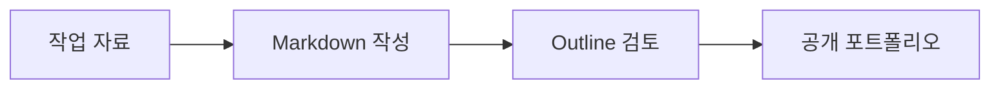

# 외부 Outline 운영 가이드

## 주소

- 공개 포트폴리오: <https://neverland.40.82.146.87.sslip.io>
- 작성 화면: <https://neverland.40.82.146.87.sslip.io/auth/oidc>
- 정적 백업: <https://wonderful-cliff-01d049c00.7.azurestaticapps.net>

공개 방문자는 글·프로젝트·소개 페이지만 봅니다. `Write` 링크와 작성 화면은 GitHub OAuth 로그인이 필요합니다.

## 최초 한 번 필요한 로그인 설정

GitHub OAuth App 설정에서 아래 값을 등록합니다.

- Homepage URL: `https://neverland.40.82.146.87.sslip.io`
- Authorization callback URL: `https://neverland.40.82.146.87.sslip.io/dex/callback`

이 작업은 GitHub 계정 인증이 필요하므로 서버 자동 배포와 별도로 진행합니다. 설정 후 회사나 외부 PC에서도 `Write`를 눌러 동일한 Outline 문서를 편집할 수 있습니다.

## Codex에 글 작성을 맡기는 흐름

1. 메모, 작업 자료, 코드 경로나 원하는 글의 목적을 전달합니다.
2. Codex가 `content/worklog`, `content/projects`, `content/pages` 중 알맞은 위치에 Markdown을 작성합니다.
3. 필요하면 Markdown에 Mermaid 설계도를 포함합니다.
4. 아래 업로드 명령으로 Outline 문서를 생성 또는 갱신합니다.
5. 공개 주소에서 실제 렌더링과 링크를 확인합니다.

```bash
OUTLINE_BASE_URL=https://neverland.40.82.146.87.sslip.io \
  npm run outline:upload -- content/projects/example.md
```

문서 제목은 가급적 고유하게 유지합니다. 업로드 도구가 같은 제목을 기준으로 기존 문서를 찾아 갱신하기 때문입니다.

## Mermaid 예시

````markdown

````

## 운영과 비용

- 기존 `empire-server` VM의 Docker 네트워크와 볼륨을 분리해 재사용합니다.
- 새 Azure 리소스나 유료 도메인을 만들지 않았습니다.
- DNS는 무료 `sslip.io`, 인증서는 무료 Let’s Encrypt를 사용합니다.
- 인증서는 서버의 systemd timer가 하루 두 번 갱신 필요 여부를 검사합니다.
- Outline DB와 첨부 파일은 매일 서버 안에 백업하고 14일간 보관합니다. 운영 전 로컬 마이그레이션 백업도 별도로 만들었으며, `.env`와 백업은 Git에 포함하지 않습니다.

현재 구성의 추가 비용은 0원입니다. 단, 기존 Azure VM 자체의 원래 사용료는 계속 발생합니다.
